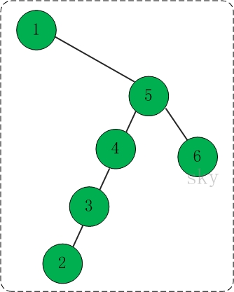
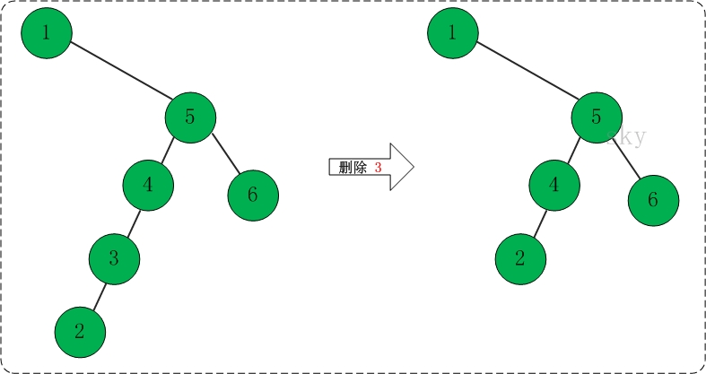

[二叉查找树(三)之 Java的实现][0]

### **概要**

在前面分别介绍了"二叉查找树的相关理论知识，然后给出了二叉查找树的C和C++实现版本"。这一章写一写二叉查找树的Java实现版本。

**目录**

1. [二叉树查找树][1]   
2. [二叉查找树的Java实现][2]   
3. [二叉查找树的Java测试程序][3]

转载请注明出处：[http://www.cnblogs.com/skywang12345/p/3576452.html][0]

- - -

**更多内容**: [数据结构与算法系列 目录][4]

(01) [二叉查找树(一)之 图文解析 和 C语言的实现][5]   
(02) [二叉查找树(二)之 C++的实现][6]   
(03) [二叉查找树(三)之 Java的实现][0]

### **二叉查找树简介**

二叉查找树(Binary Search Tree)，又被称为二叉搜索树。   
它是特殊的二叉树：对于二叉树，假设x为二叉树中的任意一个结点，x节点包含关键字key，节点x的key值记为`key[x]`。如果y是x的左子树中的一个结点，则`key[y] <= key[x]`；如果y是x的右子树的一个结点，则`key[y] >= key[x]`。那么，这棵树就是二叉查找树。如下图所示：


在二叉查找树中：   
<font face=楷体>
(01) 若任意节点的左子树不空，则左子树上所有结点的值均小于它的根结点的值；   
(02) 任意节点的右子树不空，则右子树上所有结点的值均大于它的根结点的值；   
(03) 任意节点的左、右子树也分别为二叉查找树。   
(04) 没有键值相等的节点（no duplicate nodes）。
</font>

### 二叉查找树的Java实现 

1. 二叉查找树节点的定义

 
```java
public class BSTree<T extends Comparable<T>> {

    private BSTNode<T> mRoot;    // 根结点

    public class BSTNode<T extends Comparable<T>> {
        T key;                // 关键字(键值)
        BSTNode<T> left;      // 左孩子
        BSTNode<T> right;     // 右孩子
        BSTNode<T> parent;    // 父结点

        public BSTNode(T key, BSTNode<T> parent, BSTNode<T> left, BSTNode<T> right) {
            this.key = key;
            this.parent = parent;
            this.left = left;
            this.right = right;
        }
    }

        ......
}
            
```
BSTree是二叉树，它保护了二叉树的根节点mRoot；mRoot是BSTNode类型，而BSTNode是二叉查找树的节点，它是BSTree的内部类。BSTNode包含二叉查找树的几个基本信息：   
(01) key -- 它是关键字，是用来对二叉查找树的节点进行排序的。   
(02) left -- 它指向当前节点的左孩子。   
(03) right -- 它指向当前节点的右孩子。   
(04) parent -- 它指向当前节点的父结点。

**2 遍历**

这里讲解前序遍历、中序遍历、后序遍历3种方式。

**2.1 前序遍历**  
若二叉树非空，则执行以下操作：   
(01) 访问根结点；   
(02) 先序遍历左子树；   
(03) 先序遍历右子树。

前序遍历代码

 
```java
private void preOrder(BSTNode<T> tree) {
    if(tree != null) {
        System.out.print(tree.key+" ");
        preOrder(tree.left);
        preOrder(tree.right);
    }
}

public void preOrder() {
    preOrder(mRoot);
}
```
**2.2 中序遍历**

若二叉树非空，则执行以下操作：   
(01) 中序遍历左子树；   
(02) 访问根结点；   
(03) 中序遍历右子树。

中序遍历代码

 
```java
private void inOrder(BSTNode<T> tree) {
    if(tree != null) {
        inOrder(tree.left);
        System.out.print(tree.key+" ");
        inOrder(tree.right);
    }
}

public void inOrder() {
    inOrder(mRoot);
}
```
**2.3 后序遍历**

若二叉树非空，则执行以下操作：   
(01) 后序遍历左子树；   
(02) 后序遍历右子树；   
(03) 访问根结点。

后序遍历代码

 
```java
private void postOrder(BSTNode<T> tree) {
    if(tree != null)
    {
        postOrder(tree.left);
        postOrder(tree.right);
        System.out.print(tree.key+" ");
    }
}

public void postOrder() {
    postOrder(mRoot);
}
```
看看下面这颗树的各种遍历方式：


对于上面的二叉树而言，  
(01) 前序遍历结果： 3 1 2 5 4 6  
(02) 中序遍历结果： 1 2 3 4 5 6   
(03) 后序遍历结果： 2 1 4 6 5 3

**3. 查找**

递归版本的代码

 
```java
/*
 * (递归实现)查找"二叉树x"中键值为key的节点
 */
private BSTNode<T> search(BSTNode<T> x, T key) {
    if (x==null)
        return x;

    int cmp = key.compareTo(x.key);
    if (cmp < 0)
        return search(x.left, key);
    else if (cmp > 0)
        return search(x.right, key);
    else
        return x;
}

public BSTNode<T> search(T key) {
    return search(mRoot, key);
}
```
非递归版本的代码

 
```java
/*
 * (非递归实现)查找"二叉树x"中键值为key的节点
 */
private BSTNode<T> iterativeSearch(BSTNode<T> x, T key) {
    while (x!=null) {
        int cmp = key.compareTo(x.key);

        if (cmp < 0) 
            x = x.left;
        else if (cmp > 0) 
            x = x.right;
        else
            return x;
    }

    return x;
}

public BSTNode<T> iterativeSearch(T key) {
    return iterativeSearch(mRoot, key);
}
```
  
**4. 最大值和最小值**

查找最大值的代码

 
```java
/* 
 * 查找最大结点：返回tree为根结点的二叉树的最大结点。
 */
private BSTNode<T> maximum(BSTNode<T> tree) {
    if (tree == null)
        return null;

    while(tree.right != null)
        tree = tree.right;
    return tree;
}

public T maximum() {
    BSTNode<T> p = maximum(mRoot);
    if (p != null)
        return p.key;

    return null;
}
```
查找最小值的代码

 
```java
/* 
 * 查找最小结点：返回tree为根结点的二叉树的最小结点。
 */
private BSTNode<T> minimum(BSTNode<T> tree) {
    if (tree == null)
        return null;

    while(tree.left != null)
        tree = tree.left;
    return tree;
}

public T minimum() {
    BSTNode<T> p = minimum(mRoot);
    if (p != null)
        return p.key;

    return null;
}
```
**5. 前驱和后继**

节点的前驱：是该节点的左子树中的最大节点。   
节点的后继：是该节点的右子树中的最小节点。

查找前驱节点的代码

 
```java
/* 
 * 找结点(x)的前驱结点。即，查找"二叉树中数据值小于该结点"的"最大结点"。
 */
public BSTNode<T> predecessor(BSTNode<T> x) {
    // 如果x存在左孩子，则"x的前驱结点"为 "以其左孩子为根的子树的最大结点"。
    if (x.left != null)
        return maximum(x.left);

    // 如果x没有左孩子。则x有以下两种可能：
    // (01) x是"一个右孩子"，则"x的前驱结点"为 "它的父结点"。
    // (01) x是"一个左孩子"，则查找"x的最低的父结点，并且该父结点要具有右孩子"，找到的这个"最低的父结点"就是"x的前驱结点"。
    BSTNode<T> y = x.parent;
    while ((y!=null) && (x==y.left)) {
        x = y;
        y = y.parent;
    }

    return y;
}
```
查找后继节点的代码

 
```java
/* 
 * 找结点(x)的后继结点。即，查找"二叉树中数据值大于该结点"的"最小结点"。
 */
public BSTNode<T> successor(BSTNode<T> x) {
    // 如果x存在右孩子，则"x的后继结点"为 "以其右孩子为根的子树的最小结点"。
    if (x.right != null)
        return minimum(x.right);

    // 如果x没有右孩子。则x有以下两种可能：
    // (01) x是"一个左孩子"，则"x的后继结点"为 "它的父结点"。
    // (02) x是"一个右孩子"，则查找"x的最低的父结点，并且该父结点要具有左孩子"，找到的这个"最低的父结点"就是"x的后继结点"。
    BSTNode<T> y = x.parent;
    while ((y!=null) && (x==y.right)) {
        x = y;
        y = y.parent;
    }

    return y;
}
```
**6. 插入**

插入节点的代码

 
```java
/* 
 * 将结点插入到二叉树中
 *
 * 参数说明：
 *     tree 二叉树的
 *     z 插入的结点
 */
private void insert(BSTree<T> bst, BSTNode<T> z) {
    int cmp;
    BSTNode<T> y = null;
    BSTNode<T> x = bst.mRoot;

    // 查找z的插入位置
    while (x != null) {
        y = x;
        cmp = z.key.compareTo(x.key);
        if (cmp < 0)
            x = x.left;
        else
            x = x.right;
    }

    z.parent = y;
    if (y==null)
        bst.mRoot = z;
    else {
        cmp = z.key.compareTo(y.key);
        if (cmp < 0)
            y.left = z;
        else
            y.right = z;
    }
}

/* 
 * 新建结点(key)，并将其插入到二叉树中
 *
 * 参数说明：
 *     tree 二叉树的根结点
 *     key 插入结点的键值
 */
public void insert(T key) {
    BSTNode<T> z=new BSTNode<T>(key,null,null,null);

    // 如果新建结点失败，则返回。
    if (z != null)
        insert(this, z);
}
```
注：本文实现的二叉查找树是允许插入相同键值的节点的。若想禁止二叉查找树中插入相同键值的节点，可以参考" [二叉查找树(一)之 图文解析 和 C语言的实现][5] "中的插入函数进行修改。

**7. 删除**

删除节点的代码

 
```java
/* 
 * 删除结点(z)，并返回被删除的结点
 *
 * 参数说明：
 *     bst 二叉树
 *     z 删除的结点
 */
private BSTNode<T> remove(BSTree<T> bst, BSTNode<T> z) {
    BSTNode<T> x=null;
    BSTNode<T> y=null;

    if ((z.left == null) || (z.right == null) )
        y = z;
    else
        y = successor(z);

    if (y.left != null)
        x = y.left;
    else
        x = y.right;

    if (x != null)
        x.parent = y.parent;

    if (y.parent == null)
        bst.mRoot = x;
    else if (y == y.parent.left)
        y.parent.left = x;
    else
        y.parent.right = x;

    if (y != z) 
        z.key = y.key;

    return y;
}

/* 
 * 删除结点(z)，并返回被删除的结点
 *
 * 参数说明：
 *     tree 二叉树的根结点
 *     z 删除的结点
 */
public void remove(T key) {
    BSTNode<T> z, node; 

    if ((z = search(mRoot, key)) != null)
        if ( (node = remove(this, z)) != null)
            node = null;
}
```
**8. 打印**

打印二叉查找树的代码

 
```java
/*
 * 打印"二叉查找树"
 *
 * key        -- 节点的键值 
 * direction  --  0，表示该节点是根节点;
 *               -1，表示该节点是它的父结点的左孩子;
 *                1，表示该节点是它的父结点的右孩子。
 */
private void print(BSTNode<T> tree, T key, int direction) {

    if(tree != null) {

        if(direction==0)    // tree是根节点
            System.out.printf("%2d is root\n", tree.key);
        else                // tree是分支节点
            System.out.printf("%2d is %2d's %6s child\n", tree.key, key, direction==1?"right" : "left");

        print(tree.left, tree.key, -1);
        print(tree.right,tree.key,  1);
    }
}

public void print() {
    if (mRoot != null)
        print(mRoot, mRoot.key, 0);
}
```
**9. 销毁**

销毁二叉查找树的代码

 
```java
/*
 * 销毁二叉树
 */
private void destroy(BSTNode<T> tree) {
    if (tree==null)
        return ;

    if (tree.left != null)
        destroy(tree.left);
    if (tree.right != null)
        destroy(tree.right);

    tree=null;
}

public void clear() {
    destroy(mRoot);
    mRoot = null;
}
```
**完整的实现代码**  
二叉查找树的Java实现文件( BSTree.java)
 
```java
/**
 * Java 语言: 二叉查找树
 *
 * @author skywang
 * @date 2013/11/07
 */

public class BSTree<T extends Comparable<T>> {

    private BSTNode<T> mRoot;    // 根结点

    public class BSTNode<T extends Comparable<T>> {
        T key;                // 关键字(键值)
        BSTNode<T> left;    // 左孩子
        BSTNode<T> right;    // 右孩子
        BSTNode<T> parent;    // 父结点

        public BSTNode(T key, BSTNode<T> parent, BSTNode<T> left, BSTNode<T> right) {
            this.key = key;
            this.parent = parent;
            this.left = left;
            this.right = right;
        }

        public T getKey() {
            return key;
        }

        public String toString() {
            return "key:"+key;
        }
    }

    public BSTree() {
        mRoot=null;
    }

    /*
     * 前序遍历"二叉树"
     */
    private void preOrder(BSTNode<T> tree) {
        if(tree != null) {
            System.out.print(tree.key+" ");
            preOrder(tree.left);
            preOrder(tree.right);
        }
    }

    public void preOrder() {
        preOrder(mRoot);
    }

    /*
     * 中序遍历"二叉树"
     */
    private void inOrder(BSTNode<T> tree) {
        if(tree != null) {
            inOrder(tree.left);
            System.out.print(tree.key+" ");
            inOrder(tree.right);
        }
    }

    public void inOrder() {
        inOrder(mRoot);
    }


    /*
     * 后序遍历"二叉树"
     */
    private void postOrder(BSTNode<T> tree) {
        if(tree != null)
        {
            postOrder(tree.left);
            postOrder(tree.right);
            System.out.print(tree.key+" ");
        }
    }

    public void postOrder() {
        postOrder(mRoot);
    }


    /*
     * (递归实现)查找"二叉树x"中键值为key的节点
     */
    private BSTNode<T> search(BSTNode<T> x, T key) {
        if (x==null)
            return x;

        int cmp = key.compareTo(x.key);
        if (cmp < 0)
            return search(x.left, key);
        else if (cmp > 0)
            return search(x.right, key);
        else
            return x;
    }

    public BSTNode<T> search(T key) {
        return search(mRoot, key);
    }

    /*
     * (非递归实现)查找"二叉树x"中键值为key的节点
     */
    private BSTNode<T> iterativeSearch(BSTNode<T> x, T key) {
        while (x!=null) {
            int cmp = key.compareTo(x.key);

            if (cmp < 0) 
                x = x.left;
            else if (cmp > 0) 
                x = x.right;
            else
                return x;
        }

        return x;
    }

    public BSTNode<T> iterativeSearch(T key) {
        return iterativeSearch(mRoot, key);
    }

    /* 
     * 查找最小结点：返回tree为根结点的二叉树的最小结点。
     */
    private BSTNode<T> minimum(BSTNode<T> tree) {
        if (tree == null)
            return null;

        while(tree.left != null)
            tree = tree.left;
        return tree;
    }

    public T minimum() {
        BSTNode<T> p = minimum(mRoot);
        if (p != null)
            return p.key;

        return null;
    }
     
    /* 
     * 查找最大结点：返回tree为根结点的二叉树的最大结点。
     */
    private BSTNode<T> maximum(BSTNode<T> tree) {
        if (tree == null)
            return null;

        while(tree.right != null)
            tree = tree.right;
        return tree;
    }

    public T maximum() {
        BSTNode<T> p = maximum(mRoot);
        if (p != null)
            return p.key;

        return null;
    }

    /* 
     * 找结点(x)的后继结点。即，查找"二叉树中数据值大于该结点"的"最小结点"。
     */
    public BSTNode<T> successor(BSTNode<T> x) {
        // 如果x存在右孩子，则"x的后继结点"为 "以其右孩子为根的子树的最小结点"。
        if (x.right != null)
            return minimum(x.right);

        // 如果x没有右孩子。则x有以下两种可能：
        // (01) x是"一个左孩子"，则"x的后继结点"为 "它的父结点"。
        // (02) x是"一个右孩子"，则查找"x的最低的父结点，并且该父结点要具有左孩子"，找到的这个"最低的父结点"就是"x的后继结点"。
        BSTNode<T> y = x.parent;
        while ((y!=null) && (x==y.right)) {
            x = y;
            y = y.parent;
        }

        return y;
    }
     
    /* 
     * 找结点(x)的前驱结点。即，查找"二叉树中数据值小于该结点"的"最大结点"。
     */
    public BSTNode<T> predecessor(BSTNode<T> x) {
        // 如果x存在左孩子，则"x的前驱结点"为 "以其左孩子为根的子树的最大结点"。
        if (x.left != null)
            return maximum(x.left);

        // 如果x没有左孩子。则x有以下两种可能：
        // (01) x是"一个右孩子"，则"x的前驱结点"为 "它的父结点"。
        // (01) x是"一个左孩子"，则查找"x的最低的父结点，并且该父结点要具有右孩子"，找到的这个"最低的父结点"就是"x的前驱结点"。
        BSTNode<T> y = x.parent;
        while ((y!=null) && (x==y.left)) {
            x = y;
            y = y.parent;
        }

        return y;
    }

    /* 
     * 将结点插入到二叉树中
     *
     * 参数说明：
     *     tree 二叉树的
     *     z 插入的结点
     */
    private void insert(BSTree<T> bst, BSTNode<T> z) {
        int cmp;
        BSTNode<T> y = null;
        BSTNode<T> x = bst.mRoot;

        // 查找z的插入位置
        while (x != null) {
            y = x;
            cmp = z.key.compareTo(x.key);
            if (cmp < 0)
                x = x.left;
            else
                x = x.right;
        }

        z.parent = y;
        if (y==null)
            bst.mRoot = z;
        else {
            cmp = z.key.compareTo(y.key);
            if (cmp < 0)
                y.left = z;
            else
                y.right = z;
        }
    }

    /* 
     * 新建结点(key)，并将其插入到二叉树中
     *
     * 参数说明：
     *     tree 二叉树的根结点
     *     key 插入结点的键值
     */
    public void insert(T key) {
        BSTNode<T> z=new BSTNode<T>(key,null,null,null);

        // 如果新建结点失败，则返回。
        if (z != null)
            insert(this, z);
    }

    /* 
     * 删除结点(z)，并返回被删除的结点
     *
     * 参数说明：
     *     bst 二叉树
     *     z 删除的结点
     */
    private BSTNode<T> remove(BSTree<T> bst, BSTNode<T> z) {
        BSTNode<T> x=null;
        BSTNode<T> y=null;

        if ((z.left == null) || (z.right == null) )
            y = z;
        else
            y = successor(z);

        if (y.left != null)
            x = y.left;
        else
            x = y.right;

        if (x != null)
            x.parent = y.parent;

        if (y.parent == null)
            bst.mRoot = x;
        else if (y == y.parent.left)
            y.parent.left = x;
        else
            y.parent.right = x;

        if (y != z) 
            z.key = y.key;

        return y;
    }

    /* 
     * 删除结点(z)，并返回被删除的结点
     *
     * 参数说明：
     *     tree 二叉树的根结点
     *     z 删除的结点
     */
    public void remove(T key) {
        BSTNode<T> z, node; 

        if ((z = search(mRoot, key)) != null)
            if ( (node = remove(this, z)) != null)
                node = null;
    }

    /*
     * 销毁二叉树
     */
    private void destroy(BSTNode<T> tree) {
        if (tree==null)
            return ;

        if (tree.left != null)
            destroy(tree.left);
        if (tree.right != null)
            destroy(tree.right);

        tree=null;
    }

    public void clear() {
        destroy(mRoot);
        mRoot = null;
    }

    /*
     * 打印"二叉查找树"
     *
     * key        -- 节点的键值 
     * direction  --  0，表示该节点是根节点;
     *               -1，表示该节点是它的父结点的左孩子;
     *                1，表示该节点是它的父结点的右孩子。
     */
    private void print(BSTNode<T> tree, T key, int direction) {

        if(tree != null) {

            if(direction==0)    // tree是根节点
                System.out.printf("%2d is root\n", tree.key);
            else                // tree是分支节点
                System.out.printf("%2d is %2d's %6s child\n", tree.key, key, direction==1?"right" : "left");

            print(tree.left, tree.key, -1);
            print(tree.right,tree.key,  1);
        }
    }

    public void print() {
        if (mRoot != null)
            print(mRoot, mRoot.key, 0);
    }
}
```

二叉查找树的C++测试程序( BSTreeTest.java)
 
```java
/**
 * Java 语言: 二叉查找树
 *
 * @author skywang
 * @date 2013/11/07
 */
public class BSTreeTest {

    private static final int arr[] = {1,5,4,3,2,6};

    public static void main(String[] args) {
        int i, ilen;
        BSTree<Integer> tree=new BSTree<Integer>();

        System.out.print("== 依次添加: ");
        ilen = arr.length;
        for(i=0; i<ilen; i++) {
            System.out.print(arr[i]+" ");
            tree.insert(arr[i]);
        }

        System.out.print("\n== 前序遍历: ");
        tree.preOrder();

        System.out.print("\n== 中序遍历: ");
        tree.inOrder();

        System.out.print("\n== 后序遍历: ");
        tree.postOrder();
        System.out.println();

        System.out.println("== 最小值: "+ tree.minimum());
        System.out.println("== 最大值: "+ tree.maximum());
        System.out.println("== 树的详细信息: ");
        tree.print();

        System.out.print("\n== 删除根节点: "+ arr[3]);
        tree.remove(arr[3]);

        System.out.print("\n== 中序遍历: ");
        tree.inOrder();
        System.out.println();

        // 销毁二叉树
        tree.clear();
    }
}
```

在二叉查找树的Java实现中，使用了泛型，也就意味着支持任意类型； 但是该类型必须要实现Comparable接口。

### **二叉查找树的Java测试程序**

上面的BSTreeTest.java是二叉查找树树的测试程序，运行结果如下：

 
```
    == 依次添加: 1 5 4 3 2 6 
    == 前序遍历: 1 5 4 3 2 6 
    == 中序遍历: 1 2 3 4 5 6 
    == 后序遍历: 2 3 4 6 5 1 
    == 最小值: 1
    == 最大值: 6
    == 树的详细信息: 
     1 is root
     5 is  1's  right child
     4 is  5's   left child
     3 is  4's   left child
     2 is  3's   left child
     6 is  5's  right child
    
    == 删除根节点: 3
    == 中序遍历: 1 2 4 5 6 
```
下面对测试程序的流程进行分析！

(01) 新建"二叉查找树"root。

  
(02) 向二叉查找树中依次插入**1,5,4,3,2,6**。如下图所示：


(03) 遍历和查找   
插入1,5,4,3,2,6之后，得到的二叉查找树如下：



前序遍历结果:**1 5 4 3 2 6**   
中序遍历结果: **1 2 3 4 5 6**   
后序遍历结果: **2 3 4 6 5 1**   
最小值是1，而最大值是6。

(04) 删除节点3。如下图所示：



(05) 重新遍历该二叉查找树。   
中序遍历结果: **1 2 4 5 6**

[0]: http://www.cnblogs.com/skywang12345/p/3576452.html
[1]: #a1
[2]: #a2
[3]: #a3
[4]: http://www.cnblogs.com/skywang12345/p/3603935.html
[5]: http://www.cnblogs.com/skywang12345/p/3576328.html
[6]: http://www.cnblogs.com/skywang12345/p/3576373.html