## [AVL树(一)之 图文解析 和 C语言的实现][0]

### **概要**

本章介绍AVL树。和前面介绍"[二叉查找树][1]"的流程一样，本章先对AVL树的理论知识进行简单介绍，然后给出C语言的实现。本篇实现的二叉查找树是C语言版的，后面章节再分别给出C++和Java版本的实现。   
建议：若您对"二叉查找树"不熟悉，建议先学完"[二叉查找树][1]"再来学习AVL树。

**目录**

1. [AVL树的介绍][2]   
2. [AVL树的C实现][3] 3. [AVL树的C实现(完整源码)][4]   
4. [AVL树的C测试程序][5]

转载请注明出处：[http://www.cnblogs.com/skywang12345/p/3576969.html][0]

- - -

**更多内容**: [数据结构与算法系列 目录][6]

(01) [AVL树(一)之 图文解析 和 C语言的实现][0]   
(02) [AVL树(二)之 C++的实现][7]   
(03) [AVL树(三)之 Java的实现][8]

### **AVL树的介绍**

AVL树是根据它的发明者G.M. **A**delson-**V**elsky和E.M. **L**andis命名的。   
它是最先发明的自平衡二叉查找树，也被称为高度平衡树。相比于"二叉查找树"，它的特点是：AVL树中任何节点的两个子树的高度最大差别为1。 (关于树的高度等基本概念，请参考"[二叉查找树(一)之 图文解析 和 C语言的实现][1]  ")


_上面的两张图片，左边的是AVL树，它的任何节点的两个子树的高度差别都<=1；而右边的不是AVL树，因为7的两颗子树的高度相差为2(以2为根节点的树的高度是3，而以8为根节点的树的高度是1)。_

AVL树的查找、插入和删除在平均和最坏情况下都是O(logn)。   
如果在AVL树中插入或删除节点后，使得高度之差大于1。此时，AVL树的平衡状态就被破坏，它就不再是一棵二叉树；为了让它重新维持在一个平衡状态，就需要对其进行旋转处理。学AVL树，重点的地方也就是它的旋转算法；在后文的介绍中，再来对它进行详细介绍。

### **AVL树的C实现**

**1. 节点**

**1.1 定义**

 
```c
typedef int Type;

typedef struct AVLTreeNode{
    Type key;                    // 关键字(键值)
    int height;
    struct AVLTreeNode *left;    // 左孩子
    struct AVLTreeNode *right;    // 右孩子
}Node, *AVLTree;
```
AVL树的节点包括的几个组成对象:   
(01) key -- 是关键字，是用来对AVL树的节点进行排序的。   
(02) left -- 是左孩子。   
(03) right -- 是右孩子。   
(04) height -- 是高度。

**1.2 节点的创建**

 
```c
/*
 * 创建AVL树结点。
 *
 * 参数说明：
 *     key 是键值。
 *     left 是左孩子。
 *     right 是右孩子。
 */
static Node* avltree_create_node(Type key, Node *left, Node* right)
{
    Node* p;

    if ((p = (Node *)malloc(sizeof(Node))) == NULL)
        return NULL;
    p->key = key;
    p->height = 0;
    p->left = left;
    p->right = right;

    return p;
}
```
**1.3 树的高度**

 
```c
#define HEIGHT(p)    ( (p==NULL) ? 0 : (((Node *)(p))->height) )

/*
 * 获取AVL树的高度
 */
int avltree_height(AVLTree tree)
{
    return HEIGHT(tree);
}
```
关于高度，有的文章中将"空二叉树的高度定义为-1"，而本文采用 [维基百科][9] 上的定义：树的高度为最大层次。即空的二叉树的高度是0，非空树的高度等于它的最大层次(根的层次为1，根的子节点为第2层，依次类推)。

**1.4 比较大小**

    #define MAX(a, b)    ( (a) > (b) ? (a) : (b) )

**2. 旋转**  
前面说过，如果在AVL树中进行插入或删除节点后，可能导致AVL树失去平衡。这种失去平衡的可以概括为4种姿态：LL(左左)，LR(左右)，RR(右右)和RL(右左)。下面给出它们的示意图：


上图中的4棵树都是"失去平衡的AVL树"，从左往右的情况依次是：LL、LR、RL、RR。除了上面的情况之外，还有其它的失去平衡的AVL树，如下图：


上面的两张图都是为了便于理解，而列举的关于"失去平衡的AVL树"的例子。总的来说，AVL树失去平衡时的情况一定是LL、LR、RL、RR这4种之一，它们都由各自的定义：

(1) **LL**：LeftLeft，也称为"左左"。插入或删除一个节点后，根节点的左子树的左子树还有非空子节点，导致"根的左子树的高度"比"根的右子树的高度"大2，导致AVL树失去了平衡。   
_例如，在上面LL情况中，由于"根节点(8)的左子树(4)的左子树(2)还有非空子节点"，而"根节点(8)的右子树(12)没有子节点"；导致"根节点(8)的左子树(4)高度"比"根节点(8)的右子树(12)"高2。_

(2) **LR**：LeftRight，也称为"左右"。插入或删除一个节点后，根节点的左子树的右子树还有非空子节点，导致"根的左子树的高度"比"根的右子树的高度"大2，导致AVL树失去了平衡。   
_例如，在上面LR情况中，由于"根节点(8)的左子树(4)的左子树(6)还有非空子节点"，而"根节点(8)的右子树(12)没有子节点"；导致"根节点(8)的左子树(4)高度"比"根节点(8)的右子树(12)"高2。_

(3)**RL**：RightLeft，称为"右左"。插入或删除一个节点后，根节点的右子树的左子树还有非空子节点，导致"根的右子树的高度"比"根的左子树的高度"大2，导致AVL树失去了平衡。   
_例如，在上面RL情况中，由于"根节点(8)的右子树(12)的左子树(10)还有非空子节点"，而"根节点(8)的左子树(4)没有子节点"；导致"根节点(8)的右子树(12)高度"比"根节点(8)的左子树(4)"高2。_

(4) **RR**：RightRight，称为"右右"。插入或删除一个节点后，根节点的右子树的右子树还有非空子节点，导致"根的右子树的高度"比"根的左子树的高度"大2，导致AVL树失去了平衡。   
_例如，在上面RR情况中，由于"根节点(8)的右子树(12)的右子树(14)还有非空子节点"，而"根节点(8)的左子树(4)没有子节点"；导致"根节点(8)的右子树(12)高度"比"根节点(8)的左子树(4)"高2。_

前面说过，如果在AVL树中进行插入或删除节点后，可能导致AVL树失去平衡。AVL失去平衡之后，可以通过旋转使其恢复平衡，下面分别介绍"LL(左左)，LR(左右)，RR(右右)和RL(右左)"这4种情况对应的旋转方法。

**2.1 LL的旋转**

LL失去平衡的情况，可以通过一次旋转让AVL树恢复平衡。如下图：


图中左边是旋转之前的树，右边是旋转之后的树。从中可以发现，旋转之后的树又变成了AVL树，而且该旋转只需要一次即可完成。   
对于LL旋转，你可以这样理解为： LL旋转是围绕"失去平衡的AVL根节点"进行的，也就是节点k2；而且由于是LL情况，即左左情况，就用手抓着"左孩子，即k1"使劲摇。将k1变成根节点，k2变成k1的右子树，"k1的右子树"变成"k2的左子树"。

LL的旋转代码

 
```c
/*
 * LL：左左对应的情况(左单旋转)。
 *
 * 返回值：旋转后的根节点
 */
static Node* left_left_rotation(AVLTree k2)
{
    AVLTree k1;

    k1 = k2->left;
    k2->left = k1->right;
    k1->right = k2;

    k2->height = MAX( HEIGHT(k2->left), HEIGHT(k2->right)) + 1;
    k1->height = MAX( HEIGHT(k1->left), k2->height) + 1;

    return k1;
}
```
**2.2 RR的旋转**

理解了LL之后，RR就相当容易理解了。RR是与LL对称的情况！RR恢复平衡的旋转方法如下：


图中左边是旋转之前的树，右边是旋转之后的树。RR旋转也只需要一次即可完成。

RR的旋转代码

 
```c
/*
 * RR：右右对应的情况(右单旋转)。
 *
 * 返回值：旋转后的根节点
 */
static Node* right_right_rotation(AVLTree k1)
{
    AVLTree k2;

    k2 = k1->right;
    k1->right = k2->left;
    k2->left = k1;

    k1->height = MAX( HEIGHT(k1->left), HEIGHT(k1->right)) + 1;
    k2->height = MAX( HEIGHT(k2->right), k1->height) + 1;

    return k2;
}
```
**2.3 LR的旋转**

LR失去平衡的情况，需要经过两次旋转才能让AVL树恢复平衡。如下图：


第一次旋转是围绕"k1"进行的"RR旋转"，第二次是围绕"k3"进行的"LL旋转"。

LR的旋转代码

 
```c
/*
 * LR：左右对应的情况(左双旋转)。
 *
 * 返回值：旋转后的根节点
 */
static Node* left_right_rotation(AVLTree k3)
{
    k3->left = right_right_rotation(k3->left);

    return left_left_rotation(k3);
}
```
**2.4 RL的旋转**  
RL是与LR的对称情况！RL恢复平衡的旋转方法如下：


第一次旋转是围绕"k3"进行的"LL旋转"，第二次是围绕"k1"进行的"RR旋转"。

  
RL的旋转代码

 
```c
/*
 * RL：右左对应的情况(右双旋转)。
 *
 * 返回值：旋转后的根节点
 */
static Node* right_left_rotation(AVLTree k1)
{
    k1->right = left_left_rotation(k1->right);

    return right_right_rotation(k1);
}
```
  
**3. 插入**  
插入节点的代码

 
```c
/* 
 * 将结点插入到AVL树中，并返回根节点
 *
 * 参数说明：
 *     tree AVL树的根结点
 *     key 插入的结点的键值
 * 返回值：
 *     根节点
 */
Node* avltree_insert(AVLTree tree, Type key)
{
    if (tree == NULL) 
    {
        // 新建节点
        tree = avltree_create_node(key, NULL, NULL);
        if (tree==NULL)
        {
            printf("ERROR: create avltree node failed!\n");
            return NULL;
        }
    }
    else if (key < tree->key) // 应该将key插入到"tree的左子树"的情况
    {
        tree->left = avltree_insert(tree->left, key);
        // 插入节点后，若AVL树失去平衡，则进行相应的调节。
        if (HEIGHT(tree->left) - HEIGHT(tree->right) == 2)
        {
            if (key < tree->left->key)
                tree = left_left_rotation(tree);
            else
                tree = left_right_rotation(tree);
        }
    }
    else if (key > tree->key) // 应该将key插入到"tree的右子树"的情况
    {
        tree->right = avltree_insert(tree->right, key);
        // 插入节点后，若AVL树失去平衡，则进行相应的调节。
        if (HEIGHT(tree->right) - HEIGHT(tree->left) == 2)
        {
            if (key > tree->right->key)
                tree = right_right_rotation(tree);
            else
                tree = right_left_rotation(tree);
        }
    }
    else //key == tree->key)
    {
        printf("添加失败：不允许添加相同的节点！\n");
    }

    tree->height = MAX( HEIGHT(tree->left), HEIGHT(tree->right)) + 1;

    return tree;
}
```
**4. 删除**  
删除节点的代码

 
```c
/* 
 * 删除结点(z)，返回根节点
 *
 * 参数说明：
 *     ptree AVL树的根结点
 *     z 待删除的结点
 * 返回值：
 *     根节点
 */
static Node* delete_node(AVLTree tree, Node *z)
{
    // 根为空 或者 没有要删除的节点，直接返回NULL。
    if (tree==NULL || z==NULL)
        return NULL;

    if (z->key < tree->key)        // 待删除的节点在"tree的左子树"中
    {
        tree->left = delete_node(tree->left, z);
        // 删除节点后，若AVL树失去平衡，则进行相应的调节。
        if (HEIGHT(tree->right) - HEIGHT(tree->left) == 2)
        {
            Node *r =  tree->right;
            if (HEIGHT(r->left) > HEIGHT(r->right))
                tree = right_left_rotation(tree);
            else
                tree = right_right_rotation(tree);
        }
    }
    else if (z->key > tree->key)// 待删除的节点在"tree的右子树"中
    {
        tree->right = delete_node(tree->right, z);
        // 删除节点后，若AVL树失去平衡，则进行相应的调节。
        if (HEIGHT(tree->left) - HEIGHT(tree->right) == 2)
        {
            Node *l =  tree->left;
            if (HEIGHT(l->right) > HEIGHT(l->left))
                tree = left_right_rotation(tree);
            else
                tree = left_left_rotation(tree);
        }
    }
    else    // tree是对应要删除的节点。
    {
        // tree的左右孩子都非空
        if ((tree->left) && (tree->right))
        {
            if (HEIGHT(tree->left) > HEIGHT(tree->right))
            {
                // 如果tree的左子树比右子树高；
                // 则(01)找出tree的左子树中的最大节点
                //   (02)将该最大节点的值赋值给tree。
                //   (03)删除该最大节点。
                // 这类似于用"tree的左子树中最大节点"做"tree"的替身；
                // 采用这种方式的好处是：删除"tree的左子树中最大节点"之后，AVL树仍然是平衡的。
                Node *max = avltree_maximum(tree->left);
                tree->key = max->key;
                tree->left = delete_node(tree->left, max);
            }
            else
            {
                // 如果tree的左子树不比右子树高(即它们相等，或右子树比左子树高1)
                // 则(01)找出tree的右子树中的最小节点
                //   (02)将该最小节点的值赋值给tree。
                //   (03)删除该最小节点。
                // 这类似于用"tree的右子树中最小节点"做"tree"的替身；
                // 采用这种方式的好处是：删除"tree的右子树中最小节点"之后，AVL树仍然是平衡的。
                Node *min = avltree_maximum(tree->right);
                tree->key = min->key;
                tree->right = delete_node(tree->right, min);
            }
        }
        else
        {
            Node *tmp = tree;
            tree = tree->left ? tree->left : tree->right;
            free(tmp);
        }
    }

    return tree;
}

/* 
 * 删除结点(key是节点值)，返回根节点
 *
 * 参数说明：
 *     tree AVL树的根结点
 *     key 待删除的结点的键值
 * 返回值：
 *     根节点
 */
Node* avltree_delete(AVLTree tree, Type key)
{
    Node *z; 

    if ((z = avltree_search(tree, key)) != NULL)
        tree = delete_node(tree, z);
    return tree;
}
```
**注意**： 关于AVL树的"前序遍历"、"中序遍历"、"后序遍历"、"最大值"、"最小值"、"查找"、"打印"、"销毁"等接口与" [二叉查找树][1] "基本一样，这些操作在"二叉查找树"中已经介绍过了，这里就不再单独介绍了。当然，后文给出的AVL树的完整源码中，有给出这些API的实现代码。这些接口很简单，Please RTFSC(Read The Fucking Source Code)！

### **AVL树的C实现(完整源码)**

AVL树的头文件(avltree.h)

```c
#ifndef _AVL_TREE_H_
#define _AVL_TREE_H_

typedef int Type;

typedef struct AVLTreeNode{
    Type key;                    // 关键字(键值)
    int height;
    struct AVLTreeNode *left;    // 左孩子
    struct AVLTreeNode *right;    // 右孩子
}Node, *AVLTree;

// 获取AVL树的高度
int avltree_height(AVLTree tree);

// 前序遍历"AVL树"
void preorder_avltree(AVLTree tree);
// 中序遍历"AVL树"
void inorder_avltree(AVLTree tree);
// 后序遍历"AVL树"
void postorder_avltree(AVLTree tree);

void print_avltree(AVLTree tree, Type key, int direction);

// (递归实现)查找"AVL树x"中键值为key的节点
Node* avltree_search(AVLTree x, Type key);
// (非递归实现)查找"AVL树x"中键值为key的节点
Node* iterative_avltree_search(AVLTree x, Type key);

// 查找最小结点：返回tree为根结点的AVL树的最小结点。
Node* avltree_minimum(AVLTree tree);
// 查找最大结点：返回tree为根结点的AVL树的最大结点。
Node* avltree_maximum(AVLTree tree);

// 将结点插入到AVL树中，返回根节点
Node* avltree_insert(AVLTree tree, Type key);

// 删除结点(key是节点值)，返回根节点
Node* avltree_delete(AVLTree tree, Type key);

// 销毁AVL树
void destroy_avltree(AVLTree tree);


#endif
```

AVL树的实现文件(avltree.c)

```c
/**
 * AVL树(C语言): C语言实现的AVL树。
 *
 * @author skywang
 * @date 2013/11/07
 */

#include <stdio.h>
#include <stdlib.h>
#include "avltree.h"

#define HEIGHT(p)    ( (p==NULL) ? -1 : (((Node *)(p))->height) )
#define MAX(a, b)    ( (a) > (b) ? (a) : (b) )

/*
 * 获取AVL树的高度
 */
int avltree_height(AVLTree tree)
{
    return HEIGHT(tree);
}

/*
 * 前序遍历"AVL树"
 */
void preorder_avltree(AVLTree tree)
{
    if(tree != NULL)
    {
        printf("%d ", tree->key);
        preorder_avltree(tree->left);
        preorder_avltree(tree->right);
    }
}


/*
 * 中序遍历"AVL树"
 */
void inorder_avltree(AVLTree tree)
{
    if(tree != NULL)
    {
        inorder_avltree(tree->left);
        printf("%d ", tree->key);
        inorder_avltree(tree->right);
    }
}

/*
 * 后序遍历"AVL树"
 */
void postorder_avltree(AVLTree tree)
{
    if(tree != NULL)
    {
        postorder_avltree(tree->left);
        postorder_avltree(tree->right);
        printf("%d ", tree->key);
    }
}

/*
 * (递归实现)查找"AVL树x"中键值为key的节点
 */
Node* avltree_search(AVLTree x, Type key)
{
    if (x==NULL || x->key==key)
        return x;

    if (key < x->key)
        return avltree_search(x->left, key);
    else
        return avltree_search(x->right, key);
}

/*
 * (非递归实现)查找"AVL树x"中键值为key的节点
 */
Node* iterative_avltree_search(AVLTree x, Type key)
{
    while ((x!=NULL) && (x->key!=key))
    {
        if (key < x->key)
            x = x->left;
        else
            x = x->right;
    }

    return x;
}

/* 
 * 查找最小结点：返回tree为根结点的AVL树的最小结点。
 */
Node* avltree_minimum(AVLTree tree)
{
    if (tree == NULL)
        return NULL;

    while(tree->left != NULL)
        tree = tree->left;
    return tree;
}
 
/* 
 * 查找最大结点：返回tree为根结点的AVL树的最大结点。
 */
Node* avltree_maximum(AVLTree tree)
{
    if (tree == NULL)
        return NULL;

    while(tree->right != NULL)
        tree = tree->right;
    return tree;
}

/*
 * LL：左左对应的情况(左单旋转)。
 *
 * 返回值：旋转后的根节点
 */
static Node* left_left_rotation(AVLTree k2)
{
    AVLTree k1;

    k1 = k2->left;
    k2->left = k1->right;
    k1->right = k2;

    k2->height = MAX( HEIGHT(k2->left), HEIGHT(k2->right)) + 1;
    k1->height = MAX( HEIGHT(k1->left), k2->height) + 1;

    return k1;
}

/*
 * RR：右右对应的情况(右单旋转)。
 *
 * 返回值：旋转后的根节点
 */
static Node* right_right_rotation(AVLTree k1)
{
    AVLTree k2;

    k2 = k1->right;
    k1->right = k2->left;
    k2->left = k1;

    k1->height = MAX( HEIGHT(k1->left), HEIGHT(k1->right)) + 1;
    k2->height = MAX( HEIGHT(k2->right), k1->height) + 1;

    return k2;
}

/*
 * LR：左右对应的情况(左双旋转)。
 *
 * 返回值：旋转后的根节点
 */
static Node* left_right_rotation(AVLTree k3)
{
    k3->left = right_right_rotation(k3->left);

    return left_left_rotation(k3);
}

/*
 * RL：右左对应的情况(右双旋转)。
 *
 * 返回值：旋转后的根节点
 */
static Node* right_left_rotation(AVLTree k1)
{
    k1->right = left_left_rotation(k1->right);

    return right_right_rotation(k1);
}

/*
 * 创建AVL树结点。
 *
 * 参数说明：
 *     key 是键值。
 *     left 是左孩子。
 *     right 是右孩子。
 */
static Node* avltree_create_node(Type key, Node *left, Node* right)
{
    Node* p;

    if ((p = (Node *)malloc(sizeof(Node))) == NULL)
        return NULL;
    p->key = key;
    p->height = 0;
    p->left = left;
    p->right = right;

    return p;
}

/* 
 * 将结点插入到AVL树中，并返回根节点
 *
 * 参数说明：
 *     tree AVL树的根结点
 *     key 插入的结点的键值
 * 返回值：
 *     根节点
 */
Node* avltree_insert(AVLTree tree, Type key)
{
    if (tree == NULL) 
    {
        // 新建节点
        tree = avltree_create_node(key, NULL, NULL);
        if (tree==NULL)
        {
            printf("ERROR: create avltree node failed!\n");
            return NULL;
        }
    }
    else if (key < tree->key) // 应该将key插入到"tree的左子树"的情况
    {
        tree->left = avltree_insert(tree->left, key);
        // 插入节点后，若AVL树失去平衡，则进行相应的调节。
        if (HEIGHT(tree->left) - HEIGHT(tree->right) == 2)
        {
            if (key < tree->left->key)
                tree = left_left_rotation(tree);
            else
                tree = left_right_rotation(tree);
        }
    }
    else if (key > tree->key) // 应该将key插入到"tree的右子树"的情况
    {
        tree->right = avltree_insert(tree->right, key);
        // 插入节点后，若AVL树失去平衡，则进行相应的调节。
        if (HEIGHT(tree->right) - HEIGHT(tree->left) == 2)
        {
            if (key > tree->right->key)
                tree = right_right_rotation(tree);
            else
                tree = right_left_rotation(tree);
        }
    }
    else //key == tree->key)
    {
        printf("添加失败：不允许添加相同的节点！\n");
    }

    tree->height = MAX( HEIGHT(tree->left), HEIGHT(tree->right)) + 1;

    return tree;
}

/* 
 * 删除结点(z)，返回根节点
 *
 * 参数说明：
 *     ptree AVL树的根结点
 *     z 待删除的结点
 * 返回值：
 *     根节点
 */
static Node* delete_node(AVLTree tree, Node *z)
{
    // 根为空 或者 没有要删除的节点，直接返回NULL。
    if (tree==NULL || z==NULL)
        return NULL;

    if (z->key < tree->key)        // 待删除的节点在"tree的左子树"中
    {
        tree->left = delete_node(tree->left, z);
        // 删除节点后，若AVL树失去平衡，则进行相应的调节。
        if (HEIGHT(tree->right) - HEIGHT(tree->left) == 2)
        {
            Node *r =  tree->right;
            if (HEIGHT(r->left) > HEIGHT(r->right))
                tree = right_left_rotation(tree);
            else
                tree = right_right_rotation(tree);
        }
    }
    else if (z->key > tree->key)// 待删除的节点在"tree的右子树"中
    {
        tree->right = delete_node(tree->right, z);
        // 删除节点后，若AVL树失去平衡，则进行相应的调节。
        if (HEIGHT(tree->left) - HEIGHT(tree->right) == 2)
        {
            Node *l =  tree->left;
            if (HEIGHT(l->right) > HEIGHT(l->left))
                tree = left_right_rotation(tree);
            else
                tree = left_left_rotation(tree);
        }
    }
    else    // tree是对应要删除的节点。
    {
        // tree的左右孩子都非空
        if ((tree->left) && (tree->right))
        {
            if (HEIGHT(tree->left) > HEIGHT(tree->right))
            {
                // 如果tree的左子树比右子树高；
                // 则(01)找出tree的左子树中的最大节点
                //   (02)将该最大节点的值赋值给tree。
                //   (03)删除该最大节点。
                // 这类似于用"tree的左子树中最大节点"做"tree"的替身；
                // 采用这种方式的好处是：删除"tree的左子树中最大节点"之后，AVL树仍然是平衡的。
                Node *max = avltree_maximum(tree->left);
                tree->key = max->key;
                tree->left = delete_node(tree->left, max);
            }
            else
            {
                // 如果tree的左子树不比右子树高(即它们相等，或右子树比左子树高1)
                // 则(01)找出tree的右子树中的最小节点
                //   (02)将该最小节点的值赋值给tree。
                //   (03)删除该最小节点。
                // 这类似于用"tree的右子树中最小节点"做"tree"的替身；
                // 采用这种方式的好处是：删除"tree的右子树中最小节点"之后，AVL树仍然是平衡的。
                Node *min = avltree_maximum(tree->right);
                tree->key = min->key;
                tree->right = delete_node(tree->right, min);
            }
        }
        else
        {
            Node *tmp = tree;
            tree = tree->left ? tree->left : tree->right;
            free(tmp);
        }
    }

    return tree;
}

/* 
 * 删除结点(key是节点值)，返回根节点
 *
 * 参数说明：
 *     tree AVL树的根结点
 *     key 待删除的结点的键值
 * 返回值：
 *     根节点
 */
Node* avltree_delete(AVLTree tree, Type key)
{
    Node *z; 

    if ((z = avltree_search(tree, key)) != NULL)
        tree = delete_node(tree, z);
    return tree;
}

/* 
 * 销毁AVL树
 */
void destroy_avltree(AVLTree tree)
{
    if (tree==NULL)
        return ;

    if (tree->left != NULL)
        destroy_avltree(tree->left);
    if (tree->right != NULL)
        destroy_avltree(tree->right);

    free(tree);
}

/*
 * 打印"AVL树"
 *
 * tree       -- AVL树的节点
 * key        -- 节点的键值 
 * direction  --  0，表示该节点是根节点;
 *               -1，表示该节点是它的父结点的左孩子;
 *                1，表示该节点是它的父结点的右孩子。
 */
void print_avltree(AVLTree tree, Type key, int direction)
{
    if(tree != NULL)
    {
        if(direction==0)    // tree是根节点
            printf("%2d is root\n", tree->key, key);
        else                // tree是分支节点
            printf("%2d is %2d's %6s child\n", tree->key, key, direction==1?"right" : "left");

        print_avltree(tree->left, tree->key, -1);
        print_avltree(tree->right,tree->key,  1);
    }
}
```

AVL树的测试程序(avltree_test.c)

```c
/**
 * C 语言: AVL树
 *
 * @author skywang
 * @date 2013/11/07
 */
#include <stdio.h>
#include "avltree.h"

static int arr[]= {3,2,1,4,5,6,7,16,15,14,13,12,11,10,8,9};
#define TBL_SIZE(a) ( (sizeof(a)) / (sizeof(a[0])) )

void main()
{
    int i,ilen;
    AVLTree root=NULL;

    printf("== 高度: %d\n", avltree_height(root));
    printf("== 依次添加: ");
    ilen = TBL_SIZE(arr);
    for(i=0; i<ilen; i++)
    {
        printf("%d ", arr[i]);
        root = avltree_insert(root, arr[i]);
    }

    printf("\n== 前序遍历: ");
    preorder_avltree(root);

    printf("\n== 中序遍历: ");
    inorder_avltree(root);

    printf("\n== 后序遍历: ");
    postorder_avltree(root);
    printf("\n");

    printf("== 高度: %d\n", avltree_height(root));
    printf("== 最小值: %d\n", avltree_minimum(root)->key);
    printf("== 最大值: %d\n", avltree_maximum(root)->key);
    printf("== 树的详细信息: \n");
    print_avltree(root, root->key, 0);


    i = 8;
    printf("\n== 删除根节点: %d", i);
    root = avltree_delete(root, i);

    printf("\n== 高度: %d", avltree_height(root));
    printf("\n== 中序遍历: ");
    inorder_avltree(root);
    printf("\n== 树的详细信息: \n");
    print_avltree(root, root->key, 0);

    // 销毁二叉树
    destroy_avltree(root);
}
```

### **AVL树的C测试程序**

AVL树的测试程序运行结果如下：

 
```
    == 依次添加: 3 2 1 4 5 6 7 16 15 14 13 12 11 10 8 9 
    == 前序遍历: 7 4 2 1 3 6 5 13 11 9 8 10 12 15 14 16 
    == 中序遍历: 1 2 3 4 5 6 7 8 9 10 11 12 13 14 15 16 
    == 后序遍历: 1 3 2 5 6 4 8 10 9 12 11 14 16 15 13 7 
    == 高度: 5
    == 最小值: 1
    == 最大值: 16
    == 树的详细信息: 
     7 is root
     4 is  7's   left child
     2 is  4's   left child
     1 is  2's   left child
     3 is  2's  right child
     6 is  4's  right child
     5 is  6's   left child
    13 is  7's  right child
    11 is 13's   left child
     9 is 11's   left child
     8 is  9's   left child
    10 is  9's  right child
    12 is 11's  right child
    15 is 13's  right child
    14 is 15's   left child
    16 is 15's  right child
    
    == 删除根节点: 8
    == 高度: 5
    == 中序遍历: 1 2 3 4 5 6 7 9 10 11 12 13 14 15 16 
    == 树的详细信息: 
     7 is root
     4 is  7's   left child
     2 is  4's   left child
     1 is  2's   left child
     3 is  2's  right child
     6 is  4's  right child
     5 is  6's   left child
    13 is  7's  right child
    11 is 13's   left child
     9 is 11's   left child
    10 is  9's  right child
    12 is 11's  right child
    15 is 13's  right child
    14 is 15's   left child
    16 is 15's  right child
```
下面，我们对测试程序的流程进行分析！

**1. 新建AVL树**  
新建AVL树的根节点root。

**2. 依次添加" 3,2,1,4,5,6,7,16,15,14,13,12,11,10,8,9 " 到AVL树中，过程如下。**  
**2.01 添加 3,2**  
添加3,2都不会破坏AVL树的平衡性。

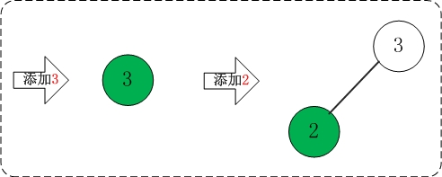

**2.02 添加 1**  
添加1之后，AVL树失去平衡(LL)，此时需要对AVL树进行旋转(LL旋转)。旋转过程如下：

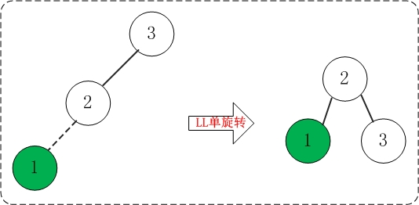

**2.03 添加 4**  
添加4不会破坏AVL树的平衡性。

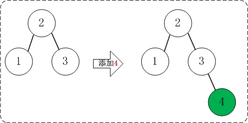

**2.04 添加 5**  
添加5之后，AVL树失去平衡(RR)，此时需要对AVL树进行旋转(RR旋转)。旋转过程如下：

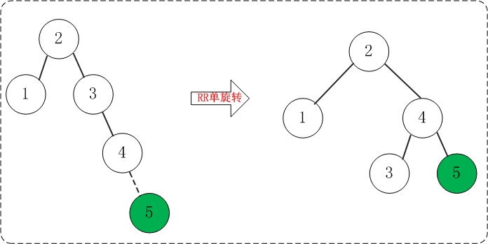

**2.05 添加 6**  
添加6之后，AVL树失去平衡(RR)，此时需要对AVL树进行旋转(RR旋转)。旋转过程如下：

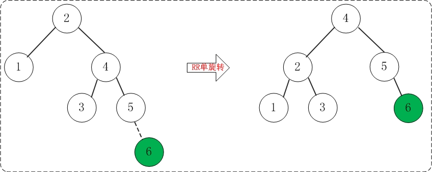

**2.06 添加 7**  
添加7之后，AVL树失去平衡(RR)，此时需要对AVL树进行旋转(RR旋转)。旋转过程如下：

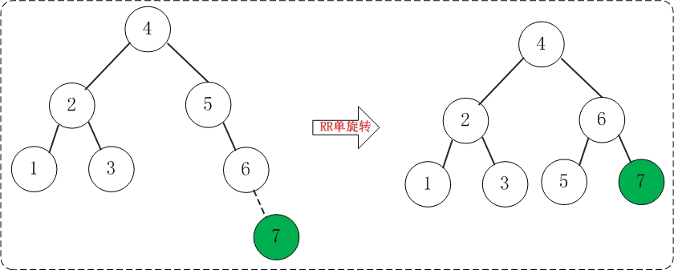

**2.07 添加 16**  
添加16不会破坏AVL树的平衡性。


**2.08 添加 15**  
添加15之后，AVL树失去平衡(RR)，此时需要对AVL树进行旋转(RR旋转)。旋转过程如下：

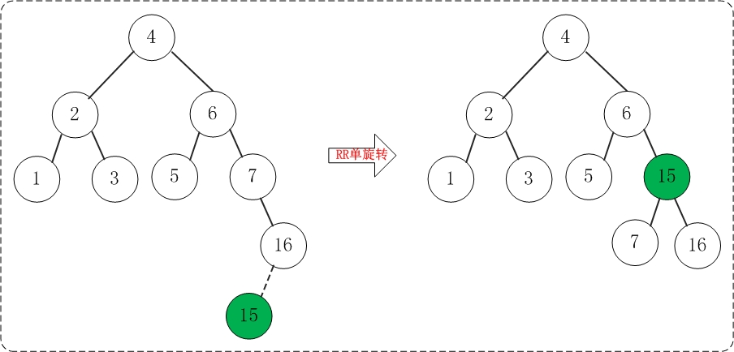

**2.09 添加 14**  
添加14之后，AVL树失去平衡(RL)，此时需要对AVL树进行旋转(RL旋转)。旋转过程如下：

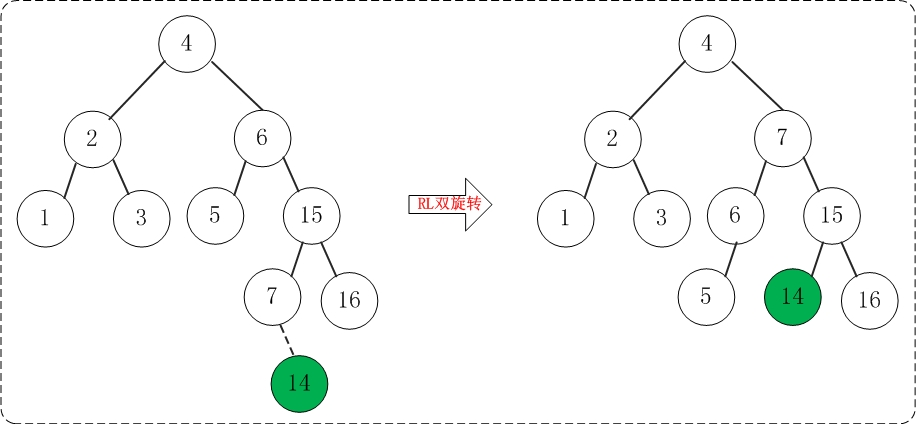

**2.10 添加 13**  
添加13之后，AVL树失去平衡(RR)，此时需要对AVL树进行旋转(RR旋转)。旋转过程如下：

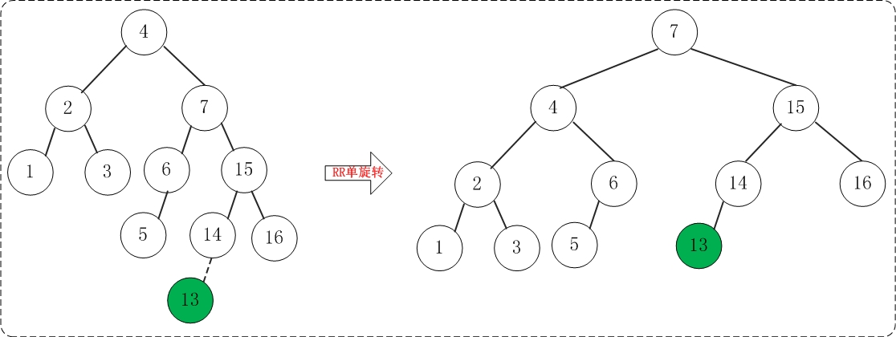

**2.11 添加 12**  
添加12之后，AVL树失去平衡(LL)，此时需要对AVL树进行旋转(LL旋转)。旋转过程如下：


**2.12 添加 11**  
添加11之后，AVL树失去平衡(LL)，此时需要对AVL树进行旋转(LL旋转)。旋转过程如下：


**2.13 添加 10**  
添加10之后，AVL树失去平衡(LL)，此时需要对AVL树进行旋转(LL旋转)。旋转过程如下：


**2.14 添加 8**  
添加8不会破坏AVL树的平衡性。


**2.15 添加 9**  
但是添加9之后，AVL树失去平衡(LR)，此时需要对AVL树进行旋转(LR旋转)。旋转过程如下：

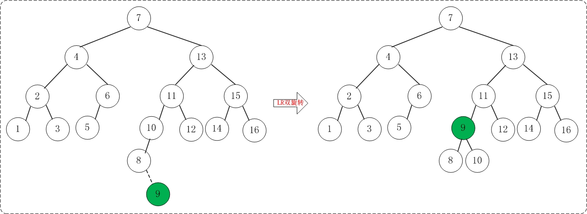

  
**3. 打印树的信息**  
输出下面树的信息：

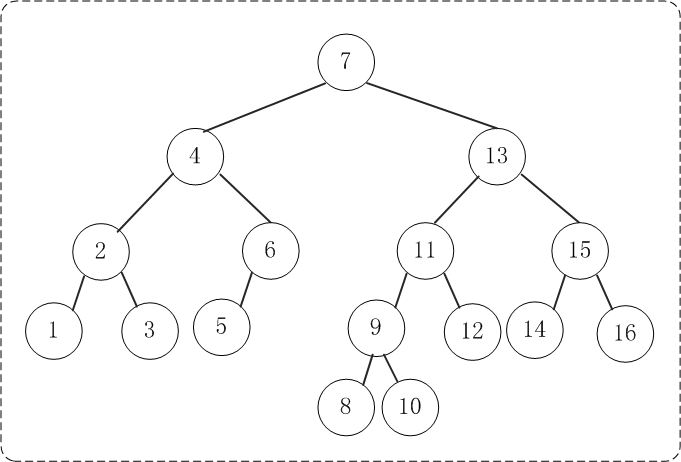

前序遍历:**7 4 2 1 3 6 5 13 11 9 8 10 12 15 14 16**   
中序遍历:**1 2 3 4 5 6 7 8 9 10 11 12 13 14 15 16**   
后序遍历:**1 3 2 5 6 4 8 10 9 12 11 14 16 15 13 7**   
高度: **5**   
最小值: **1**   
最大值: **16**

**4. 删除节点8**

删除操作并不会造成AVL树的不平衡。


删除节点8之后，在打印该AVL树的信息。   
高度: 5   
中序遍历: 1 2 3 4 5 6 7 9 10 11 12 13 14 15 16

[0]: http://www.cnblogs.com/skywang12345/p/3576969.html
[1]: http://www.cnblogs.com/skywang12345/p/3576328.html
[2]: #a1
[3]: #a2
[4]: #aa1
[5]: #a3
[6]: http://www.cnblogs.com/skywang12345/p/3603935.html
[7]: http://www.cnblogs.com/skywang12345/p/3577360.html
[8]: http://www.cnblogs.com/skywang12345/p/3577479.html
[9]: http://zh.wikipedia.org/zh-cn/%E6%A0%91_(%E6%95%B0%E6%8D%AE%E7%BB%93%E6%9E%84)
