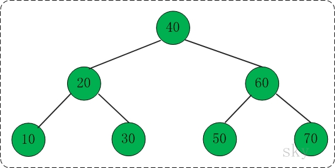
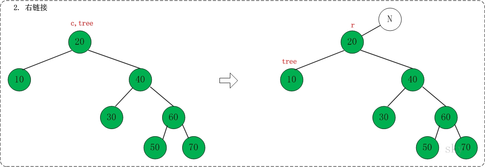
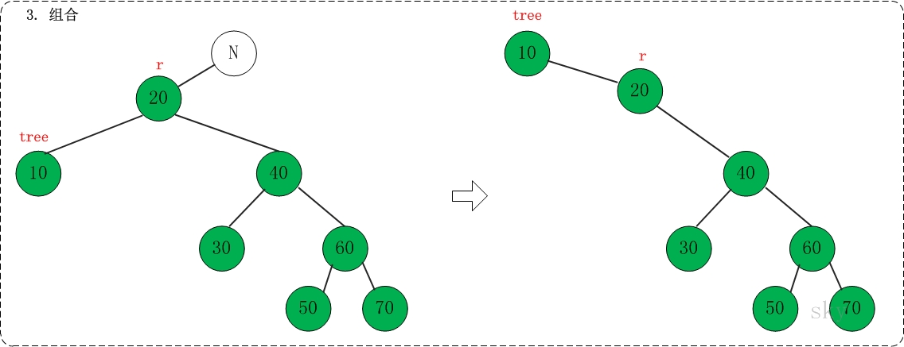
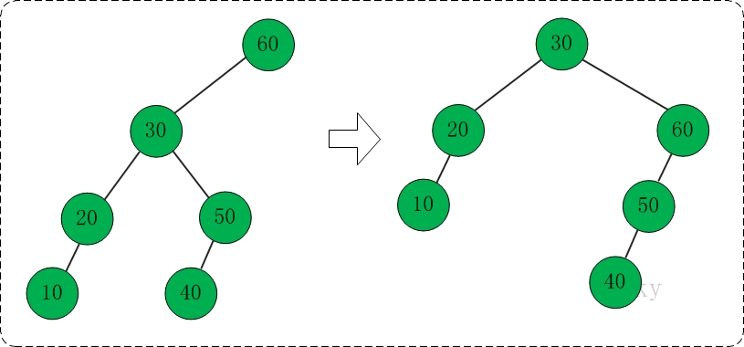

## [伸展树(一)之 图文解析 和 C语言的实现][0]
<font face=黑体>
### 概要 

本章介绍伸展树。它和"[二叉查找树][1]"和"[AVL树][2]"一样，都是特殊的二叉树。在了解了"[二叉查找树][1]"和"[AVL树][2]"之后，学习伸展树是一件相当容易的事情。和以往一样，本文会先对伸展树的理论知识进行简单介绍，然后给出C语言的实现。后序再分别给出C++和Java版本的实现；这3种实现方式的原理都一样，选择其中之一进行了解即可。若文章有错误或不足的地方，希望您能不吝指出！

**目录**  
1. [伸展树的介绍][3]   
2. [伸展树的C实现][4]   
3. [伸展树的C测试程序][5]

转载请注明出处：[http://www.cnblogs.com/skywang12345/p/3604238.html][0]

- - -

**更多内容**: [数据结构与算法系列 目录][6]

(01) [伸展树(一)之 图文解析 和 C语言的实现][0]   
(02) [伸展树(二)之 C++的实现][7]   
(03) [伸展树(三)之 Java的实现][8]

### **伸展树的介绍**

伸展树(Splay Tree)是一种二叉排序树，它能在O(log n)内完成插入、查找和删除操作。它由Daniel Sleator和Robert Tarjan创造。   
(01) 伸展树属于二叉查找树，即它具有和二叉查找树一样的性质：假设x为树中的任意一个结点，x节点包含关键字key，节点x的key值记为key[x]。如果y是x的左子树中的一个结点，则key[y] <= key[x]；如果y是x的右子树的一个结点，则key[y] >= key[x]。   
(02) 除了拥有二叉查找树的性质之外，伸展树还具有的一个特点是：当某个节点被访问时，伸展树会通过旋转使该节点成为树根。这样做的好处是，下次要访问该节点时，能够迅速的访问到该节点。

假设想要对一个二叉查找树执行一系列的查找操作。为了使整个查找时间更小，被查频率高的那些条目就应当经常处于靠近树根的位置。于是想到设计一个简单方法，在每次查找之后对树进行重构，把被查找的条目搬移到离树根近一些的地方。伸展树应运而生，它是一种自调整形式的二叉查找树，它会沿着从某个节点到树根之间的路径，通过一系列的旋转把这个节点搬移到树根去。

相比于"二叉查找树"和"AVL树"，学习伸展树时需要重点关注是"伸展树的旋转算法"。

### **伸展树的C实现**

**1. 节点定义**

 
```c

typedef int Type;

typedef struct SplayTreeNode {
    Type key;                        // 关键字(键值)
    struct SplayTreeNode *left;        // 左孩子
    struct SplayTreeNode *right;    // 右孩子
} Node, *SplayTree; 
```

伸展树的节点包括的几个组成元素:   
(01) key -- 是关键字，是用来对伸展树的节点进行排序的。   
(02) left -- 是左孩子。   
(03) right -- 是右孩子。

**外部接口**

 
```c

// 前序遍历"伸展树"
void preorder_splaytree(SplayTree tree);
// 中序遍历"伸展树"
void inorder_splaytree(SplayTree tree);
// 后序遍历"伸展树"
void postorder_splaytree(SplayTree tree);

// (递归实现)查找"伸展树x"中键值为key的节点
Node* splaytree_search(SplayTree x, Type key);
// (非递归实现)查找"伸展树x"中键值为key的节点
Node* iterative_splaytree_search(SplayTree x, Type key);

// 查找最小结点：返回tree为根结点的伸展树的最小结点。
Node* splaytree_minimum(SplayTree tree);
// 查找最大结点：返回tree为根结点的伸展树的最大结点。
Node* splaytree_maximum(SplayTree tree);

// 旋转key对应的节点为根节点。
Node* splaytree_splay(SplayTree tree, Type key);

// 将结点插入到伸展树中，并返回根节点
Node* insert_splaytree(SplayTree tree, Type key);

// 删除结点(key为节点的值)，并返回根节点
Node* delete_splaytree(SplayTree tree, Type key);

// 销毁伸展树
void destroy_splaytree(SplayTree tree);

// 打印伸展树
void print_splaytree(SplayTree tree, Type key, int direction);
```

**2. 旋转**

旋转的代码

 
```c

/* 
 * 旋转key对应的节点为根节点，并返回根节点。
 *
 * 注意：
 *   (a)：伸展树中存在"键值为key的节点"。
 *          将"键值为key的节点"旋转为根节点。
 *   (b)：伸展树中不存在"键值为key的节点"，并且key < tree->key。
 *      b-1 "键值为key的节点"的前驱节点存在的话，将"键值为key的节点"的前驱节点旋转为根节点。
 *      b-2 "键值为key的节点"的前驱节点存在的话，则意味着，key比树中任何键值都小，那么此时，将最小节点旋转为根节点。
 *   (c)：伸展树中不存在"键值为key的节点"，并且key > tree->key。
 *      c-1 "键值为key的节点"的后继节点存在的话，将"键值为key的节点"的后继节点旋转为根节点。
 *      c-2 "键值为key的节点"的后继节点不存在的话，则意味着，key比树中任何键值都大，那么此时，将最大节点旋转为根节点。
 */
Node* splaytree_splay(SplayTree tree, Type key)
{
    Node N, *l, *r, *c;

    if (tree == NULL) 
        return tree;

    N.left = N.right = NULL;
    l = r = &N;

    for (;;)
    {
        if (key < tree->key)
        {
            if (tree->left == NULL)
                break;
            if (key < tree->left->key)
            {
                c = tree->left;                           /* 01, rotate right */
                tree->left = c->right;
                c->right = tree;
                tree = c;
                if (tree->left == NULL) 
                    break;
            }
            r->left = tree;                               /* 02, link right */
            r = tree;
            tree = tree->left;
        }
        else if (key > tree->key)
        {
            if (tree->right == NULL) 
                break;
            if (key > tree->right->key) 
            {
                c = tree->right;                          /* 03, rotate left */
                tree->right = c->left;
                c->left = tree;
                tree = c;
                if (tree->right == NULL) 
                    break;
            }
            l->right = tree;                              /* 04, link left */
            l = tree;
            tree = tree->right;
        }
        else
        {
            break;
        }
    }

    l->right = tree->left;                                /* 05, assemble */
    r->left = tree->right;
    tree->left = N.right;
    tree->right = N.left;

    return tree;
}
```

上面的代码的作用：将"键值为key的节点"旋转为根节点，并返回根节点。它的处理情况共包括：   
**(a)：伸展树中存在"键值为key的节点"。**  
将"键值为key的节点"旋转为根节点。   
**(b)：伸展树中不存在"键值为key的节点"，并且key < tree->key。**  
b-1) "键值为key的节点"的前驱节点存在的话，将"键值为key的节点"的前驱节点旋转为根节点。   
b-2) "键值为key的节点"的前驱节点存在的话，则意味着，key比树中任何键值都小，那么此时，将最小节点旋转为根节点。   
**(c)：伸展树中不存在"键值为key的节点"，并且key > tree->key。**  
c-1) "键值为key的节点"的后继节点存在的话，将"键值为key的节点"的后继节点旋转为根节点。   
c-2) "键值为key的节点"的后继节点不存在的话，则意味着，key比树中任何键值都大，那么此时，将最大节点旋转为根节点。

下面列举个例子分别对a进行说明。

在下面的伸展树中查找10，共包括"右旋" --> "右链接" --> "组合"这3步。



**第一步： 右旋**  
对应代码中的"rotate right"部分


**第二步： 右链接**  
对应代码中的"link right"部分



**第三步： 组合**  
对应代码中的"assemble"部分



提示：如果在上面的伸展树中查找"70"，则正好与"示例1"对称，而对应的操作则分别是"rotate left", "link left"和"assemble"。   
其它的情况，例如"查找15是b-1的情况，查找5是b-2的情况"等等，这些都比较简单，大家可以自己分析。

**3. 插入**

 
```c

/* 
 * 将结点插入到伸展树中(不旋转)
 *
 * 参数说明：
 *     tree 伸展树的根结点
 *     z 插入的结点
 * 返回值：
 *     根节点
 */
static Node* splaytree_insert(SplayTree tree, Node *z)
{
    Node *y = NULL;
    Node *x = tree;

    // 查找z的插入位置
    while (x != NULL)
    {
        y = x;
        if (z->key < x->key)
            x = x->left;
        else if (z->key > x->key)
            x = x->right;
        else
        {
            printf("不允许插入相同节点(%d)!\n", z->key);
            // 释放申请的节点，并返回tree。
            free(z);
            return tree;
        }
    }

    if (y==NULL)
        tree = z;
    else if (z->key < y->key)
        y->left = z;
    else
        y->right = z;

    return tree;
}

/*
 * 创建并返回伸展树结点。
 *
 * 参数说明：
 *     key 是键值。
 *     parent 是父结点。
 *     left 是左孩子。
 *     right 是右孩子。
 */
static Node* create_splaytree_node(Type key, Node *left, Node* right)
{
    Node* p;

    if ((p = (Node *)malloc(sizeof(Node))) == NULL)
        return NULL;
    p->key = key;
    p->left = left;
    p->right = right;

    return p;
}

/* 
 * 新建结点(key)，然后将其插入到伸展树中，并将插入节点旋转为根节点
 *
 * 参数说明：
 *     tree 伸展树的根结点
 *     key 插入结点的键值
 * 返回值：
 *     根节点
 */
Node* insert_splaytree(SplayTree tree, Type key)
{
    Node *z;    // 新建结点

    // 如果新建结点失败，则返回。
    if ((z=create_splaytree_node(key, NULL, NULL)) == NULL)
        return tree;

    // 插入节点
    tree = splaytree_insert(tree, z);
    // 将节点(key)旋转为根节点
    tree = splaytree_splay(tree, key);
}
```

**外部接口**: insert_splaytree(tree, key)是提供给外部的接口，它的作用是新建节点(节点的键值为key)，并将节点插入到伸展树中；然后，将该节点旋转为根节点。

**内部接口** : splaytree_insert(tree, z)是内部接口，它的作用是将节点z插入到tree中。splaytree_insert(tree, z)在将z插入到tree中时，仅仅只将tree当作是一棵二叉查找树，而且不允许插入相同节点。

**4. 删除**

删除接口

 
```c

/* 
 * 删除结点(key为节点的键值)，并返回根节点。
 *
 * 参数说明：
 *     tree 伸展树的根结点
 *     z 删除的结点
 * 返回值：
 *     根节点(根节点是被删除节点的前驱节点)
 *
 */
Node* delete_splaytree(SplayTree tree, Type key)
{
    Node *x;

    if (tree == NULL) 
        return NULL;

    // 查找键值为key的节点，找不到的话直接返回。
    if (splaytree_search(tree, key) == NULL)
        return tree;

    // 将key对应的节点旋转为根节点。
    tree = splaytree_splay(tree, key);

    if (tree->left != NULL)
    {
        // 将"tree的前驱节点"旋转为根节点
        x = splaytree_splay(tree->left, key);
        // 移除tree节点
        x->right = tree->right;
    }
    else
        x = tree->right;

    free(tree);

    return x;
}
```

delete_splaytree(tree, key)的作用是：删除伸展树中键值为key的节点。   
它会先在伸展树中查找键值为key的节点。若没有找到的话，则直接返回。若找到的话，则将该节点旋转为根节点，然后再删除该节点。

<font color=red>
**注意**： 关于伸展树的"前序遍历"、"中序遍历"、"后序遍历"、"最大值"、"最小值"、"查找"、"打印"、"销毁"等接口与"[二叉查找树][1]"基本一样，这些操作在"二叉查找树"中已经介绍过了，这里就不再单独介绍了。当然，后文给出的伸展树的完整源码中，有给出这些API的实现代码。这些接口很简单，Please RTFSC(Read The Fucking Source Code)！
</font>

### **伸展树的C实现(完整源码)**

伸展树的头文件(splay_tree.h)

```c

#ifndef _SPLAY_TREE_H_
#define _SPLAY_TREE_H_

typedef int Type;

typedef struct SplayTreeNode {
    Type key;                        // 关键字(键值)
    struct SplayTreeNode *left;        // 左孩子
    struct SplayTreeNode *right;    // 右孩子
} Node, *SplayTree; 

// 前序遍历"伸展树"
void preorder_splaytree(SplayTree tree);
// 中序遍历"伸展树"
void inorder_splaytree(SplayTree tree);
// 后序遍历"伸展树"
void postorder_splaytree(SplayTree tree);

// (递归实现)查找"伸展树x"中键值为key的节点
Node* splaytree_search(SplayTree x, Type key);
// (非递归实现)查找"伸展树x"中键值为key的节点
Node* iterative_splaytree_search(SplayTree x, Type key);

// 查找最小结点：返回tree为根结点的伸展树的最小结点。
Node* splaytree_minimum(SplayTree tree);
// 查找最大结点：返回tree为根结点的伸展树的最大结点。
Node* splaytree_maximum(SplayTree tree);

// 旋转key对应的节点为根节点。
Node* splaytree_splay(SplayTree tree, Type key);

// 将结点插入到伸展树中，并返回根节点
Node* insert_splaytree(SplayTree tree, Type key);

// 删除结点(key为节点的值)，并返回根节点
Node* delete_splaytree(SplayTree tree, Type key);

// 销毁伸展树
void destroy_splaytree(SplayTree tree);

// 打印伸展树
void print_splaytree(SplayTree tree, Type key, int direction);

#endif
```


伸展树的实现文件(splay_tree.c)

```c

/**
 * SplayTree伸展树(C语言): C语言实现的伸展树。
 *
 * @author skywang
 * @date 2014/02/03
 */

#include <stdio.h>
#include <stdlib.h>
#include "splay_tree.h"

/*
 * 前序遍历"伸展树"
 */
void preorder_splaytree(SplayTree tree)
{
    if(tree != NULL)
    {
        printf("%d ", tree->key);
        preorder_splaytree(tree->left);
        preorder_splaytree(tree->right);
    }
}

/*
 * 中序遍历"伸展树"
 */
void inorder_splaytree(SplayTree tree)
{
    if(tree != NULL)
    {
        inorder_splaytree(tree->left);
        printf("%d ", tree->key);
        inorder_splaytree(tree->right);
    }
}

/*
 * 后序遍历"伸展树"
 */
void postorder_splaytree(SplayTree tree)
{
    if(tree != NULL)
    {
        postorder_splaytree(tree->left);
        postorder_splaytree(tree->right);
        printf("%d ", tree->key);
    }
}

/*
 * (递归实现)查找"伸展树x"中键值为key的节点
 */
Node* splaytree_search(SplayTree x, Type key)
{
    if (x==NULL || x->key==key)
        return x;

    if (key < x->key)
        return splaytree_search(x->left, key);
    else
        return splaytree_search(x->right, key);
}

/*
 * (非递归实现)查找"伸展树x"中键值为key的节点
 */
Node* iterative_splaytree_search(SplayTree x, Type key)
{
    while ((x!=NULL) && (x->key!=key))
    {
        if (key < x->key)
            x = x->left;
        else
            x = x->right;
    }

    return x;
}

/* 
 * 查找最小结点：返回tree为根结点的伸展树的最小结点。
 */
Node* splaytree_minimum(SplayTree tree)
{
    if (tree == NULL)
        return NULL;

    while(tree->left != NULL)
        tree = tree->left;
    return tree;
}
 
/* 
 * 查找最大结点：返回tree为根结点的伸展树的最大结点。
 */
Node* splaytree_maximum(SplayTree tree)
{
    if (tree == NULL)
        return NULL;

    while(tree->right != NULL)
        tree = tree->right;
    return tree;
}

/* 
 * 旋转key对应的节点为根节点，并返回根节点。
 *
 * 注意：
 *   (a)：伸展树中存在"键值为key的节点"。
 *          将"键值为key的节点"旋转为根节点。
 *   (b)：伸展树中不存在"键值为key的节点"，并且key < tree->key。
 *      b-1 "键值为key的节点"的前驱节点存在的话，将"键值为key的节点"的前驱节点旋转为根节点。
 *      b-2 "键值为key的节点"的前驱节点存在的话，则意味着，key比树中任何键值都小，那么此时，将最小节点旋转为根节点。
 *   (c)：伸展树中不存在"键值为key的节点"，并且key > tree->key。
 *      c-1 "键值为key的节点"的后继节点存在的话，将"键值为key的节点"的后继节点旋转为根节点。
 *      c-2 "键值为key的节点"的后继节点不存在的话，则意味着，key比树中任何键值都大，那么此时，将最大节点旋转为根节点。
 */
Node* splaytree_splay(SplayTree tree, Type key)
{
    Node N, *l, *r, *c;

    if (tree == NULL) 
        return tree;

    N.left = N.right = NULL;
    l = r = &N;

    for (;;)
    {
        if (key < tree->key)
        {
            if (tree->left == NULL)
                break;
            if (key < tree->left->key)
            {
                c = tree->left;                           /* 01, rotate right */
                tree->left = c->right;
                c->right = tree;
                tree = c;
                if (tree->left == NULL) 
                    break;
            }
            r->left = tree;                               /* 02, link right */
            r = tree;
            tree = tree->left;
        }
        else if (key > tree->key)
        {
            if (tree->right == NULL) 
                break;
            if (key > tree->right->key) 
            {
                c = tree->right;                          /* 03, rotate left */
                tree->right = c->left;
                c->left = tree;
                tree = c;
                if (tree->right == NULL) 
                    break;
            }
            l->right = tree;                              /* 04, link left */
            l = tree;
            tree = tree->right;
        }
        else
        {
            break;
        }
    }

    l->right = tree->left;                                /* 05, assemble */
    r->left = tree->right;
    tree->left = N.right;
    tree->right = N.left;

    return tree;
}

/* 
 * 将结点插入到伸展树中(不旋转)
 *
 * 参数说明：
 *     tree 伸展树的根结点
 *     z 插入的结点
 * 返回值：
 *     根节点
 */
static Node* splaytree_insert(SplayTree tree, Node *z)
{
    Node *y = NULL;
    Node *x = tree;

    // 查找z的插入位置
    while (x != NULL)
    {
        y = x;
        if (z->key < x->key)
            x = x->left;
        else if (z->key > x->key)
            x = x->right;
        else
        {
            printf("不允许插入相同节点(%d)!\n", z->key);
            // 释放申请的节点，并返回tree。
            free(z);
            return tree;
        }
    }

    if (y==NULL)
        tree = z;
    else if (z->key < y->key)
        y->left = z;
    else
        y->right = z;

    return tree;
}

/*
 * 创建并返回伸展树结点。
 *
 * 参数说明：
 *     key 是键值。
 *     parent 是父结点。
 *     left 是左孩子。
 *     right 是右孩子。
 */
static Node* create_splaytree_node(Type key, Node *left, Node* right)
{
    Node* p;

    if ((p = (Node *)malloc(sizeof(Node))) == NULL)
        return NULL;
    p->key = key;
    p->left = left;
    p->right = right;

    return p;
}

/* 
 * 新建结点(key)，然后将其插入到伸展树中，并将插入节点旋转为根节点
 *
 * 参数说明：
 *     tree 伸展树的根结点
 *     key 插入结点的键值
 * 返回值：
 *     根节点
 */
Node* insert_splaytree(SplayTree tree, Type key)
{
    Node *z;    // 新建结点

    // 如果新建结点失败，则返回。
    if ((z=create_splaytree_node(key, NULL, NULL)) == NULL)
        return tree;

    // 插入节点
    tree = splaytree_insert(tree, z);
    // 将节点(key)旋转为根节点
    tree = splaytree_splay(tree, key);
}

/* 
 * 删除结点(key为节点的键值)，并返回根节点。
 *
 * 参数说明：
 *     tree 伸展树的根结点
 *     z 删除的结点
 * 返回值：
 *     根节点(根节点是被删除节点的前驱节点)
 *
 */
Node* delete_splaytree(SplayTree tree, Type key)
{
    Node *x;

    if (tree == NULL) 
        return NULL;

    // 查找键值为key的节点，找不到的话直接返回。
    if (splaytree_search(tree, key) == NULL)
        return tree;

    // 将key对应的节点旋转为根节点。
    tree = splaytree_splay(tree, key);

    if (tree->left != NULL)
    {
        // 将"tree的前驱节点"旋转为根节点
        x = splaytree_splay(tree->left, key);
        // 移除tree节点
        x->right = tree->right;
    }
    else
        x = tree->right;

    free(tree);

    return x;
}

/*
 * 销毁伸展树
 */
void destroy_splaytree(SplayTree tree)
{
    if (tree==NULL)
        return ;

    if (tree->left != NULL)
        destroy_splaytree(tree->left);
    if (tree->right != NULL)
        destroy_splaytree(tree->right);

    free(tree);
}

/*
 * 打印"伸展树"
 *
 * tree       -- 伸展树的节点
 * key        -- 节点的键值 
 * direction  --  0，表示该节点是根节点;
 *               -1，表示该节点是它的父结点的左孩子;
 *                1，表示该节点是它的父结点的右孩子。
 */
void print_splaytree(SplayTree tree, Type key, int direction)
{
    if(tree != NULL)
    {
        if(direction==0)    // tree是根节点
            printf("%2d is root\n", tree->key);
        else                // tree是分支节点
            printf("%2d is %2d's %6s child\n", tree->key, key, direction==1?"right" : "left");

        print_splaytree(tree->left, tree->key, -1);
        print_splaytree(tree->right,tree->key,  1);
    }
}
```


伸展树的测试程序(splaytree_test.c)

```c

/**
 * C 语言: 伸展树测试程序
 *
 * @author skywang
 * @date 2014/02/03
 */

#include <stdio.h>
#include "splay_tree.h"

static int arr[]= {10,50,40,30,20,60};
#define TBL_SIZE(a) ( (sizeof(a)) / (sizeof(a[0])) )

void main()
{
    int i, ilen;
    SplayTree root=NULL;

    printf("== 依次添加: ");
    ilen = TBL_SIZE(arr);
    for(i=0; i<ilen; i++)
    {
        printf("%d ", arr[i]);
        root = insert_splaytree(root, arr[i]);
    }

    printf("\n== 前序遍历: ");
    preorder_splaytree(root);

    printf("\n== 中序遍历: ");
    inorder_splaytree(root);

    printf("\n== 后序遍历: ");
    postorder_splaytree(root);
    printf("\n");

    printf("== 最小值: %d\n", splaytree_minimum(root)->key);
    printf("== 最大值: %d\n", splaytree_maximum(root)->key);
    printf("== 树的详细信息: \n");
    print_splaytree(root, root->key, 0);

    i = 30;
    printf("\n== 旋转节点(%d)为根节点\n", i);
    printf("== 树的详细信息: \n");
    root = splaytree_splay(root, i);
    print_splaytree(root, root->key, 0);

    // 销毁伸展树
    destroy_splaytree(root);
}
```


### **伸展树的C测试程序**

伸展树的测试程序运行结果如下：

 
```

    == 依次添加: 10 50 40 30 20 60 
    == 前序遍历: 60 30 20 10 50 40 
    == 中序遍历: 10 20 30 40 50 60 
    == 后序遍历: 10 20 40 50 30 60 
    == 最小值: 10
    == 最大值: 60
    == 树的详细信息: 
    60 is root
    30 is 60's   left child
    20 is 30's   left child
    10 is 20's   left child
    50 is 30's  right child
    40 is 50's   left child
    
    == 旋转节点(30)为根节点
    == 树的详细信息: 
    30 is root
    20 is 30's   left child
    10 is 20's   left child
    60 is 30's  right child
    50 is 60's   left child
    40 is 50's   left child
```

测试程序的主要流程是：新建伸展树，然后向伸展树中依次插入10,50,40,30,20,60。插入完毕这些数据之后，伸展树的节点是60；此时，再旋转节点，使得30成为根节点。   
依次插入10,50,40,30,20,60示意图如下：


将30旋转为根节点的示意图如下：



</font>

[0]: http://www.cnblogs.com/skywang12345/p/3604238.html
[1]: http://www.cnblogs.com/skywang12345/p/3576328.html
[2]: http://www.cnblogs.com/skywang12345/p/3576969.html
[3]: #a1
[4]: #a2
[5]: #a4
[6]: http://www.cnblogs.com/skywang12345/p/3603935.html
[7]: http://www.cnblogs.com/skywang12345/p/3604258.html
[8]: http://www.cnblogs.com/skywang12345/p/3604286.html