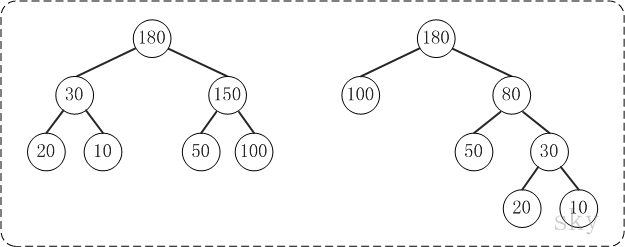
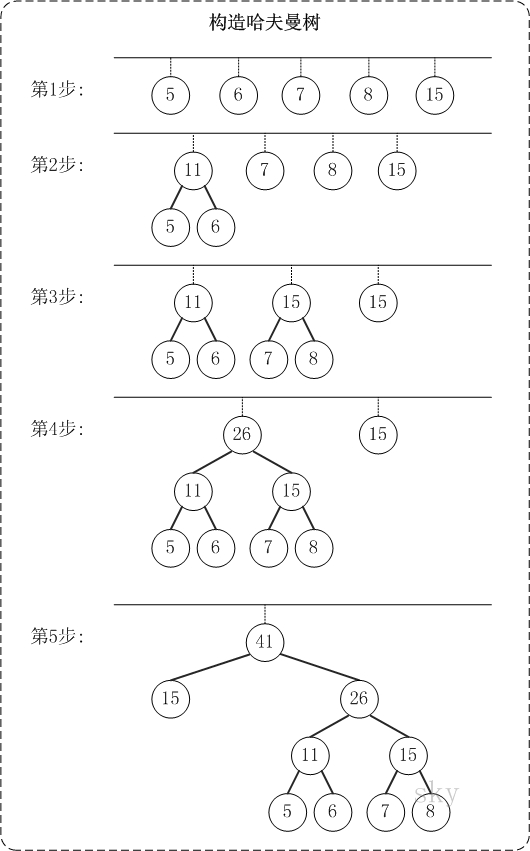

## [哈夫曼树(一)之 C语言详解][0]
<font face=黑体>

 > 本章介绍哈夫曼树。和以往一样，本文会先对哈夫曼树的理论知识进行简单介绍，然后给出C语言的实现。后续再分别给出C++和Java版本的实现；实现的语言虽不同，但是原理如出一辙，选择其中之一进行了解即可。若文章有错误或不足的地方，请帮忙指出！

**目录**

**1**. [哈夫曼树的介绍][1]  
**2**. [哈夫曼树的图文解析][2]  
**3**. [哈夫曼树的基本操作][3]  
**4**. [哈夫曼树的完整源码][4]

- - -

> 转载请注明出处：[http://www.cnblogs.com/skywang12345/][5]

> 更多内容：[数据结构与算法系列 目录][6]

### **哈夫曼树的介绍**

Huffman Tree，中文名是哈夫曼树或霍夫曼树，它是最优二叉树。

**定义**：给定n个权值作为n个叶子结点，构造一棵二叉树，若树的带权路径长度达到最小，则这棵树被称为哈夫曼树。 这个定义里面涉及到了几个陌生的概念，下面就是一颗哈夫曼树，我们来看图解答。


(01) 路径和路径长度

> **定义**：在一棵树中，从一个结点往下可以达到的孩子或孙子结点之间的通路，称为路径。通路中分支的数目称为路径长度。若规定根结点的层数为1，则从根结点到第L层结点的路径长度为L-1。   
> **例子**：100和80的路径长度是1，50和30的路径长度是2，20和10的路径长度是3。

 (02) 结点的权及带权路径长度

> **定义**：若将树中结点赋给一个有着某种含义的数值，则这个数值称为该结点的权。结点的带权路径长度为：从根结点到该结点之间的路径长度与该结点的权的乘积。   
> **例子**：节点20的路径长度是3，它的带权路径长度= 路径长度 * 权 = 3 * 20 = 60。

 (03) 树的带权路径长度

> **定义**：树的带权路径长度规定为所有叶子结点的带权路径长度之和，记为WPL。   
> **例子**：示例中，树的WPL= 1*100 + 2*80 + 3*20 + 3*10 = 100 + 160 + 60 + 30 = 350。

   
比较下面两棵树



上面的两棵树都是以{10, 20, 50, 100}为叶子节点的树。

> 左边的树WPL=2*10 + 2*20 + 2*50 + 2*100 = 360   
> 右边的树WPL=350

 左边的树WPL > 右边的树的WPL。你也可以计算除上面两种示例之外的情况，但实际上右边的树就是{10,20,50,100}对应的哈夫曼树。至此，应该堆哈夫曼树的概念有了一定的了解了，下面看看如何去构造一棵哈夫曼树。

### **哈夫曼树的图文解析**

假设有n个权值，则构造出的哈夫曼树有n个叶子结点。 n个权值分别设为w<sub>1</sub>、w<sub>2</sub>、…，w<sub>n</sub>，哈夫曼树的构造规则为：

> **1**. 将w<sub>1</sub>、w<sub>2</sub>、…，w<sub>n</sub>看成是有n 棵树的森林(每棵树仅有一个结点)；   
> **2**. 在森林中选出根结点的权值最小的两棵树进行合并，作为一棵新树的左、右子树，且新树的根结点权值为其左、右子树根结点权值之和；   
> **3**. 从森林中删除选取的两棵树，并将新树加入森林；   
> **4**. 重复(02)、(03)步，直到森林中只剩一棵树为止，该树即为所求得的哈夫曼树。

   
以{5,6,7,8,15}为例，来构造一棵哈夫曼树。



**第1步**：创建森林，森林包括5棵树，这5棵树的权值分别是5,6,7,8,15。   
**第2步**：在森林中，选择根节点权值最小的两棵树(5和6)来进行合并，将它们作为一颗新树的左右孩子(谁左谁右无关紧要，这里，我们选择较小的作为左孩子)，并且新树的权值是左右孩子的权值之和。即，新树的权值是11。 然后，将"树5"和"树6"从森林中删除，并将新的树(树11)添加到森林中。   
**第3步**：在森林中，选择根节点权值最小的两棵树(7和8)来进行合并。得到的新树的权值是15。 然后，将"树7"和"树8"从森林中删除，并将新的树(树15)添加到森林中。   
**第4步**：在森林中，选择根节点权值最小的两棵树(11和15)来进行合并。得到的新树的权值是26。 然后，将"树11"和"树15"从森林中删除，并将新的树(树26)添加到森林中。   
**第5步**：在森林中，选择根节点权值最小的两棵树(15和26)来进行合并。得到的新树的权值是41。 然后，将"树15"和"树26"从森林中删除，并将新的树(树41)添加到森林中。   
此时，森林中只有一棵树(树41)。这棵树就是我们需要的哈夫曼树！

### **哈夫曼树的基本操作**

哈夫曼树的重点是如何构造哈夫曼树。本文构造哈夫曼时，用到了以前介绍过的"(二叉堆)最小堆"。下面对哈夫曼树进行讲解。

**1. 基本定义**

 
```c

    typedef int Type;
    
    typedef struct _HuffmanNode {
        Type key;                     // 权值
        struct _HuffmanNode *left;    // 左孩子
        struct _HuffmanNode *right;   // 右孩子
        struct _HuffmanNode *parent;  // 父节点
    } HuffmanNode, *HuffmanTree;
    
```

HuffmanNode是哈夫曼树的节点类。

**2. 构造哈夫曼树**

 
```c

    /*
     * 创建Huffman树
     *
     * 参数说明：
     *     a 权值数组
     *     size 数组大小
     *
     * 返回值：
     *     Huffman树的根
     */
    HuffmanNode* create_huffman(Type a[], int size)
    {
        int i;
        HuffmanNode *left, *right, *parent;
    
        // 建立数组a对应的最小堆
        create_minheap(a, size);
    
        for(i=0; i<size-1; i++)
        {   
            left = dump_from_minheap();  // 最小节点是左孩子
            right = dump_from_minheap(); // 其次才是右孩子
    
            // 新建parent节点，左右孩子分别是left/right；
            // parent的大小是左右孩子之和
            parent = huffman_create_node(left->key+right->key, left, right, NULL);
            left->parent = parent;
            right->parent = parent;
    
    
            // 将parent节点数据拷贝到"最小堆"中
            if (dump_to_minheap(parent)!=0)
            {
                printf("插入失败!\n结束程序\n");
                destroy_huffman(parent);
                parent = NULL;
                break;
            }
        }   
    
        // 销毁最小堆
        destroy_minheap();
    
        return parent;
    }
    
```

首先通过create_huffman(a, size)来创建最小堆。最小堆构造完成之后，进入for循环。

每次循环时：

> (01) 首先，将最小堆中的最小节点拷贝一份并赋值给left，然后重塑最小堆(将最小节点和后面的节点交换位置，接着将"交换位置后的最小节点"之前的全部元素重新构造成最小堆)；   
> (02) 接着，再将最小堆中的最小节点拷贝一份并将其赋值right，然后再次重塑最小堆；   
> (03) 然后，新建节点parent，并将它作为left和right的父节点；   
> (04) 接着，将parent的数据复制给最小堆中的指定节点。

 在[二叉堆][7]中已经介绍过堆，这里就不再对堆的代码进行说明了。若有疑问，直接参考后文的源码。其它的相关代码，也Please RTFSC(Read The Fucking Source Code)！

### **哈夫曼树的完整源码**

哈夫曼树的源码共包括4个文件。

**1**. [哈夫曼树的头文件(huffman.h)][8]
```c
#ifndef _AVL_TREE_H_
#define _AVL_TREE_H_

typedef int Type;

typedef struct _HuffmanNode{
    Type key;                   // 权值
    struct _HuffmanNode *left;  // 左孩子
    struct _HuffmanNode *right; // 右孩子
    struct _HuffmanNode *parent;    // 父节点
}HuffmanNode, *HuffmanTree;

// 前序遍历"Huffman树"
void preorder_huffman(HuffmanTree tree);
// 中序遍历"Huffman树"
void inorder_huffman(HuffmanTree tree);
// 后序遍历"Huffman树"
void postorder_huffman(HuffmanTree tree);

// 创建Huffman树
HuffmanNode* create_huffman(Type arr[], int size);

// 销毁Huffman树
void destroy_huffman(HuffmanTree tree);

// 打印Huffman树
void print_huffman(HuffmanTree tree);

#endif
```

**2**. [哈夫曼树的实现文件(huffman.c)][9]
```c
/**
 * Huffman树(C语言): C语言实现的Huffman树。
 *
 * 构造Huffman树时，使用到了最小堆。
 *
 * @author skywang
 * @date 2014/03/25
 */

#include <stdio.h>
#include <stdlib.h>
#include "huffman.h"

// 创建最小堆
extern void create_minheap(Type a[], int size);
// 新建一个节点，并将最小堆中最小节点的数据复制给该节点。
extern HuffmanNode* dump_from_minheap();
// 将data插入到二叉堆中。0表示成功，-1表示失败。
extern int dump_to_minheap(HuffmanNode *node);
// 销毁最小堆
extern void destroy_minheap();

/*
 * 前序遍历"Huffman树"
 */
void preorder_huffman(HuffmanTree tree)
{
    if(tree != NULL)
    {
        printf("%d ", tree->key);
        preorder_huffman(tree->left);
        preorder_huffman(tree->right);
    }
}


/*
 * 中序遍历"Huffman树"
 */
void inorder_huffman(HuffmanTree tree)
{
    if(tree != NULL)
    {
        inorder_huffman(tree->left);
        printf("%d ", tree->key);
        inorder_huffman(tree->right);
    }
}

/*
 * 后序遍历"Huffman树"
 */
void postorder_huffman(HuffmanTree tree)
{
    if(tree != NULL)
    {
        postorder_huffman(tree->left);
        postorder_huffman(tree->right);
        printf("%d ", tree->key);
    }
}

/*
 * 创建Huffman树结点。
 *
 * 参数说明：
 *     key 是键值。
 *     left 是左孩子。
 *     right 是右孩子。
 *     parent 是父节点
 */
HuffmanNode* huffman_create_node(Type key, HuffmanNode *left, HuffmanNode* right, HuffmanNode* parent)
{
    HuffmanNode* p;

    if ((p = (HuffmanNode *)malloc(sizeof(HuffmanNode))) == NULL)
        return NULL;
    p->key = key;
    p->left = left;
    p->right = right;
    p->parent = parent;

    return p;
}

/*
 * 创建Huffman树
 *
 * 参数说明：
 *     a 权值数组
 *     size 数组大小
 *
 * 返回值：
 *     Huffman树的根
 */
HuffmanNode* create_huffman(Type a[], int size)
{
    int i;
    HuffmanNode *left, *right, *parent;

    // 建立数组a对应的最小堆
    create_minheap(a, size);
 
    for(i=0; i<size-1; i++)
    {   
        left = dump_from_minheap();  // 最小节点是左孩子
        right = dump_from_minheap(); // 其次才是右孩子
 
        // 新建parent节点，左右孩子分别是left/right；
        // parent的大小是左右孩子之和
        parent = huffman_create_node(left->key+right->key, left, right, NULL);
        left->parent = parent;
        right->parent = parent;
 

        // 将parent节点数据拷贝到"最小堆"中
        if (dump_to_minheap(parent)!=0)
        {
            printf("插入失败!\n结束程序\n");
            destroy_huffman(parent);
            parent = NULL;
            break;
        }
    }   

    // 销毁最小堆
    destroy_minheap();

    return parent;
}

/* 
 * 销毁Huffman树
 */
void destroy_huffman(HuffmanTree tree)
{
    if (tree==NULL)
        return ;

    if (tree->left != NULL)
        destroy_huffman(tree->left);
    if (tree->right != NULL)
        destroy_huffman(tree->right);

    free(tree);
}

/*
 * 打印"Huffman树"
 *
 * tree       -- Huffman树的节点
 * key        -- 节点的键值 
 * direction  --  0，表示该节点是根节点;
 *               -1，表示该节点是它的父结点的左孩子;
 *                1，表示该节点是它的父结点的右孩子。
 */
void huffman_print(HuffmanTree tree, Type key, int direction)
{
    if(tree != NULL)
    {
        if(direction==0)    // tree是根节点
            printf("%2d is root\n", tree->key, key);
        else                // tree是分支节点
            printf("%2d is %2d's %6s child\n", tree->key, key, direction==1?"right" : "left");

        huffman_print(tree->left, tree->key, -1);
        huffman_print(tree->right,tree->key,  1);
    }
}

void print_huffman(HuffmanTree tree)
{
    if (tree!=NULL)
        huffman_print(tree, tree->key, 0);
}
```

**3**. [哈夫曼树对应的最小堆(minheap.c)][10]
```c
/**
 * 最小堆：为Huffman树服务的。
 *
 * @author skywang
 * @date 2014/03/25
 */

#include <stdio.h>
#include <stdlib.h>
#include "huffman.h"

static HuffmanNode *m_heap; // 最小堆的数组
static int m_capacity;      // 总的容量
static int m_size;          // 当前有效数据的数量
 
/* 
 * 最小堆的向下调整算法
 *
 * 注：数组实现的堆中，第N个节点的左孩子的索引值是(2N+1)，右孩子的索引是(2N+2)。
 *
 * 参数说明：
 *     start -- 被下调节点的起始位置(一般为0，表示从第1个开始)
 *     end   -- 截至范围(一般为数组中最后一个元素的索引)
 */
static void minheap_filterdown(int start, int end)
{
    int c = start;      // 当前(current)节点的位置
    int l = 2*c + 1;    // 左(left)孩子的位置
    HuffmanNode tmp = m_heap[c];    // 当前(current)节点

    while(l <= end)
    {
        // "l"是左孩子，"l+1"是右孩子
        if(l < end && m_heap[l].key > m_heap[l+1].key)
            l++;        // 左右两孩子中选择较小者，即m_heap[l+1]
        if(tmp.key <= m_heap[l].key)
            break;      //调整结束
        else
        {
            m_heap[c] = m_heap[l];
            c = l;
            l = 2*l + 1;   
        }       
    }   
    m_heap[c] = tmp;
}
 
/*
 * 最小堆的向上调整算法(从start开始向上直到0，调整堆)
 *
 * 注：数组实现的堆中，第N个节点的左孩子的索引值是(2N+1)，右孩子的索引是(2N+2)。
 *
 * 参数说明：
 *     start -- 被上调节点的起始位置(一般为数组中最后一个元素的索引)
 */
static void filter_up(int start)
{
    int c = start;          // 当前节点(current)的位置
    int p = (c-1)/2;        // 父(parent)结点的位置 
    HuffmanNode tmp = m_heap[c];        // 当前节点(current)

    while(c > 0)
    {
        if(m_heap[p].key <= tmp.key)
            break;
        else
        {
            m_heap[c] = m_heap[p];
            c = p;
            p = (p-1)/2;   
        }       
    }
    m_heap[c] = tmp;
}
  
/* 
 * 将node插入到二叉堆中
 *
 * 返回值：
 *     0，表示成功
 *    -1，表示失败
 */
int dump_to_minheap(HuffmanNode *node)
{
    // 如果"堆"已满，则返回
    if(m_size == m_capacity)
        return -1;
 
    m_heap[m_size] = *node;     // 将"node的数据"全部复制到"数组末尾"
    filter_up(m_size);          // 向上调整堆
    m_size++;                   // 堆的实际容量+1

    return 0;
}

/*
 * 交换两个HuffmanNode节点的全部数据
 */
static void swap_node(int i, int j)
{
    HuffmanNode tmp = m_heap[i];
    m_heap[i] = m_heap[j];
    m_heap[j] = tmp;
}

/* 
 * 新建一个节点，并将最小堆中最小节点的数据复制给该节点。
 * 然后除最小节点之外的数据重新构造成最小堆。
 *
 * 返回值：
 *     失败返回NULL。
 */
HuffmanNode* dump_from_minheap()
{
    // 如果"堆"已空，则返回
    if(m_size == 0)
        return NULL;

    HuffmanNode *node;
    if((node = (HuffmanNode *)malloc(sizeof(HuffmanNode))) == NULL)
        return NULL;

    // 将"最小节点的全部数据"复制给node
    *node = m_heap[0];

    swap_node(0, m_size-1);             // 交换"最小节点"和"最后一个节点"
    minheap_filterdown(0, m_size-2);    // 将m_heap[0...m_size-2]构造成一个最小堆
    m_size--;                       

    return node;
}

/* 
 * 打印二叉堆
 *
 * 返回值：
 *     0，表示成功
 *    -1，表示失败
 */
void minheap_print()
{
    int i;
    for (i=0; i<m_size; i++)
        printf("%d ", m_heap[i].key);
}

/* 
 * 创建最小堆
 *
 * 参数说明：
 *     a -- 数据所在的数组
 *     size -- 数组大小
 */
void create_minheap(Type a[], int size)
{
    int i;

    // 创建最小堆所对应的数组
    m_size = size;
    m_capacity = size;
    m_heap = (HuffmanNode *)malloc(sizeof(HuffmanNode)*size);
    
    // 初始化数组
    for(i=0; i<size; i++)
    {
        m_heap[i].key = a[i];
        m_heap[i].parent = m_heap[i].left = m_heap[i].right = NULL;
    }

    // 从(size/2-1) --> 0逐次遍历。遍历之后，得到的数组实际上是一个最小堆。
    for (i = size / 2 - 1; i >= 0; i--)
        minheap_filterdown(i, size-1);
}

// 销毁最小堆
void destroy_minheap()
{
    m_size = 0;
    m_capacity = 0;
    free(m_heap);
}
```

**4**. [哈夫曼树的测试程序(huffman_test.c)][11]
```c
/**
 * C 语言: Huffman树
 *
 * @author skywang
 * @date 2014/03/25
 */
#include <stdio.h>
#include "huffman.h"

#define LENGTH(a) ( (sizeof(a)) / (sizeof(a[0])) )

void main()
{
    int a[]= {5,6,8,7,15};
    int i,ilen=LENGTH(a);
    HuffmanTree root=NULL;

    printf("== 添加数组: ");
    for(i=0; i<ilen; i++)
        printf("%d ", a[i]);

    // 创建数组a对应的Huffman树
    root = create_huffman(a, ilen);

    printf("\n== 前序遍历: ");
    preorder_huffman(root);

    printf("\n== 中序遍历: ");
    inorder_huffman(root);

    printf("\n== 后序遍历: ");
    postorder_huffman(root);
    printf("\n");

    printf("== 树的详细信息: \n");
    print_huffman(root);

    // 销毁二叉树
    destroy_huffman(root);
}
```

</font>

[0]: http://www.cnblogs.com/skywang12345/p/3706370.html
[1]: #anchor1
[2]: #anchor2
[3]: #anchor3
[4]: #anchor4
[5]: http://www.cnblogs.com/skywang12345/
[6]: http://www.cnblogs.com/skywang12345/p/3603935.html
[7]: http://www.cnblogs.com/skywang12345/p/3610187.html
[8]: https://github.com/wangkuiwu/datastructs_and_algorithm/blob/master/source/tree/huffman/c/huffman.h
[9]: https://github.com/wangkuiwu/datastructs_and_algorithm/blob/master/source/tree/huffman/c/huffman.c
[10]: https://github.com/wangkuiwu/datastructs_and_algorithm/blob/master/source/tree/huffman/c/minheap.c
[11]: https://github.com/wangkuiwu/datastructs_and_algorithm/blob/master/source/tree/huffman/c/huffman_test.c