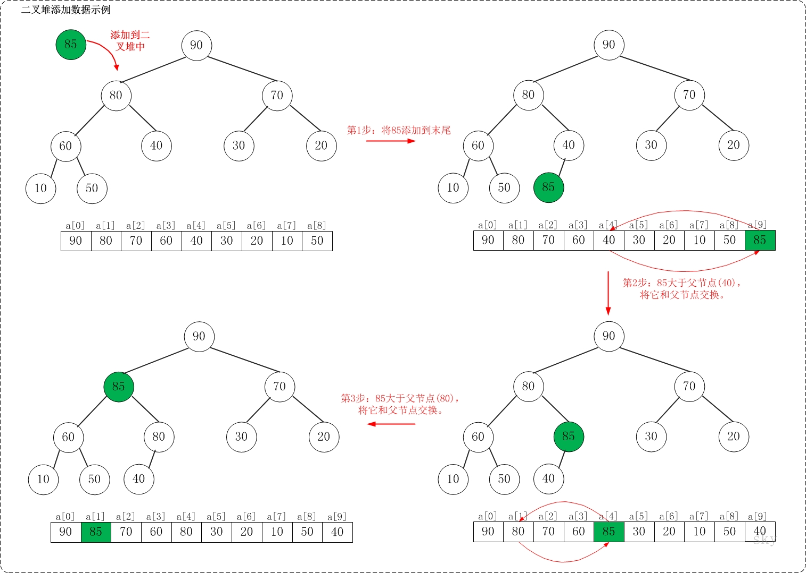
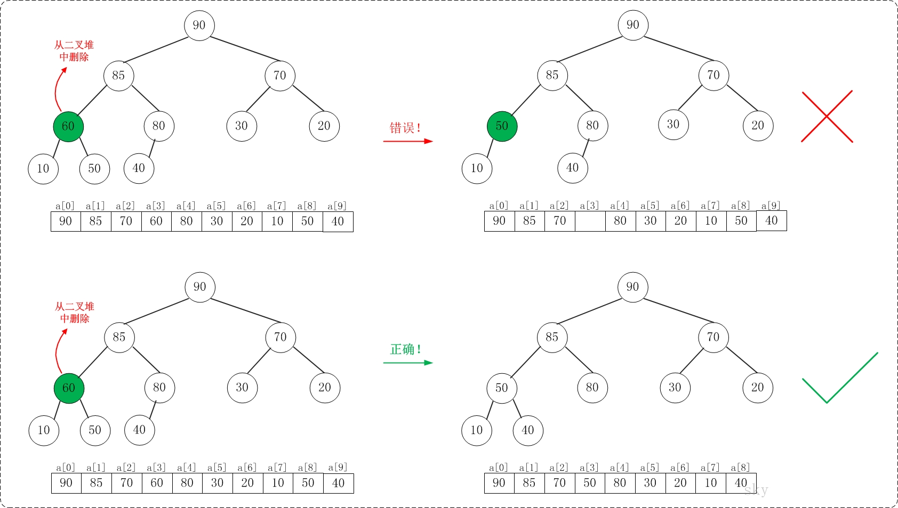

## [二叉堆(一)之 图文解析 和 C语言的实现][0]
<font face=黑体>

### **概要**

本章介绍二叉堆，二叉堆就是通常我们所说的数据结构中"堆"中的一种。和以往一样，本文会先对二叉堆的理论知识进行简单介绍，然后给出C语言的实现。后续再分别给出C++和Java版本的实现；实现的语言虽不同，但是原理如出一辙，选择其中之一进行了解即可。若文章有错误或不足的地方，请不吝指出！

**目录**  
1. [堆和二叉堆的介绍][1]   
2. [二叉堆的图文解析][2]   
3. [二叉堆的C实现(完整源码)][3]   
4. [二叉堆的C测试程序][4]

转载请注明出处：[http://www.cnblogs.com/skywang12345/p/3610187.html][0]

- - -

**更多内容：** [数据结构与算法系列 目录][5]

(01) [二叉堆(一)之 图文解析 和 C语言的实现][0]   
(02) [二叉堆(二)之 C++的实现][6]   
(03) [二叉堆(三)之 Java的实][7]

### **堆和二叉堆的介绍**

**堆的定义**

堆(heap)，这里所说的堆是数据结构中的堆，而不是内存模型中的堆。堆通常是一个可以被看做一棵树，它满足下列性质：   
[**性质一**] 堆中任意节点的值总是不大于(不小于)其子节点的值；   
[**性质二**] 堆总是一棵完全树。   
将任意节点不大于其子节点的堆叫做 最小堆 或 小根堆 ，而将任意节点不小于其子节点的堆叫做 最大堆 或 大根堆 。常见的堆有二叉堆、左倾堆、斜堆、二项堆、斐波那契堆等等。

**二叉堆的定义**

二叉堆是完全二元树或者是近似完全二元树，它分为两种： 最大堆 和 最小堆 。   
最大堆：父结点的键值总是大于或等于任何一个子节点的键值；最小堆：父结点的键值总是小于或等于任何一个子节点的键值。示意图如下：


二叉堆一般都通过" 数组 "来实现。数组实现的二叉堆，父节点和子节点的位置存在一定的关系。有时候，我们将"二叉堆的第一个元素"放在数组索引0的位置，有时候放在1的位置。当然，它们的本质一样(都是二叉堆)，只是实现上稍微有一丁点区别。   
假设"第一个元素"在数组中的索引为 0 的话，则父节点和子节点的位置关系如下：   
<font face=楷体>
(01) 索引为i的左孩子的索引是 (2\*i+1);   
(02) 索引为i的左孩子的索引是 (2\*i+2);   
(03) 索引为i的父结点的索引是 floor((i-1)/2);</font>


假设"第一个元素"在数组中的索引为 1 的话，则父节点和子节点的位置关系如下：   
<font face=楷体>
(01) 索引为i的左孩子的索引是 (2\*i);   
(02) 索引为i的左孩子的索引是 (2\*i+1);   
(03) 索引为i的父结点的索引是 floor(i/2);</font>


注意：本文二叉堆的实现统统都是采用"二叉堆第一个元素在数组索引为0"的方式！

### **二叉堆的图文解析**

在前面，我们已经了解到："最大堆"和"最小堆"是对称关系。这也意味着，了解其中之一即可。本节的 图文解析是以"最大堆"来进行介绍的。

二叉堆的核心是"添加节点"和"删除节点"，理解这两个算法，二叉堆也就基本掌握了。下面对它们进行介绍。

**1. 添加**

假设在最大堆[90,80,70,60,40,30,20,10,50]种添加85，需要执行的步骤如下：



_如上图所示，当向最大堆中添加数据时：先将数据加入到最大堆的最后，然后尽可能把这个元素往上挪，直到挪不动为止！_  
将85添加到[90,80,70,60,40,30,20,10,50]中后，最大堆变成了[90,85,70,60,80,30,20,10,50,40]。

**最大堆的插入代码(C语言)**

 
```c

    /*
     * 最大堆的向上调整算法(从start开始向上直到0，调整堆)
     *
     * 注：数组实现的堆中，第N个节点的左孩子的索引值是(2N+1)，右孩子的索引是(2N+2)。
     *
     * 参数说明：
     *     start -- 被上调节点的起始位置(一般为数组中最后一个元素的索引)
     */
    static void maxheap_filterup(int start)
    {
        int c = start;            // 当前节点(current)的位置
        int p = (c-1)/2;        // 父(parent)结点的位置 
        int tmp = m_heap[c];        // 当前节点(current)的大小
    
        while(c > 0)
        {
            if(m_heap[p] >= tmp)
                break;
            else
            {
                m_heap[c] = m_heap[p];
                c = p;
                p = (p-1)/2;   
            }       
        }
        m_heap[c] = tmp;
    }
      
    /* 
     * 将data插入到二叉堆中
     *
     * 返回值：
     *     0，表示成功
     *    -1，表示失败
     */
    int maxheap_insert(int data)
    {
        // 如果"堆"已满，则返回
        if(m_size == m_capacity)
            return -1;
     
        m_heap[m_size] = data;        // 将"数组"插在表尾
        maxheap_filterup(m_size);    // 向上调整堆
        m_size++;                    // 堆的实际容量+1
    
        return 0;
    }
```

maxheap_insert(data)的作用：将数据data添加到最大堆中。   
当堆已满的时候，添加失败；否则data添加到最大堆的末尾。然后通过上调算法重新调整数组，使之重新成为最大堆。

**2. 删除**

假设从最大堆[90,85,70,60,80,30,20,10,50,40]中删除90，需要执行的步骤如下：


从[90,85,70,60,80,30,20,10,50,40]删除90之后，最大堆变成了[85,80,70,60,40,30,20,10,50]。   
_如上图所示，当从最大堆中删除数据时：先删除该数据，然后用最大堆中最后一个的元素插入这个空位；接着，把这个“空位”尽量往上挪，直到剩余的数据变成一个最大堆。_

注意：考虑从最大堆[90,85,70,60,80,30,20,10,50,40]中删除60，执行的步骤不能单纯的用它的子节点来替换；而必须考虑到"替换后的树仍然要是最大堆"！



**最大堆的删除代码(C语言)**

 
```c

    /* 
     * 返回data在二叉堆中的索引
     *
     * 返回值：
     *     存在 -- 返回data在数组中的索引
     *     不存在 -- -1
     */
    int get_index(int data)
    {
        int i=0;
    
        for(i=0; i<m_size; i++)
            if (data==m_heap[i])
                return i;
    
        return -1;
    }
    
    /* 
     * 最大堆的向下调整算法
     *
     * 注：数组实现的堆中，第N个节点的左孩子的索引值是(2N+1)，右孩子的索引是(2N+2)。
     *
     * 参数说明：
     *     start -- 被下调节点的起始位置(一般为0，表示从第1个开始)
     *     end   -- 截至范围(一般为数组中最后一个元素的索引)
     */
    static void maxheap_filterdown(int start, int end)
    {
        int c = start;          // 当前(current)节点的位置
        int l = 2*c + 1;     // 左(left)孩子的位置
        int tmp = m_heap[c];    // 当前(current)节点的大小
    
        while(l <= end)
        {
            // "l"是左孩子，"l+1"是右孩子
            if(l < end && m_heap[l] < m_heap[l+1])
                l++;        // 左右两孩子中选择较大者，即m_heap[l+1]
            if(tmp >= m_heap[l])
                break;        //调整结束
            else
            {
                m_heap[c] = m_heap[l];
                c = l;
                l = 2*l + 1;   
            }       
        }   
        m_heap[c] = tmp;
    }
    
    /*
     * 删除最大堆中的data
     *
     * 返回值：
     *      0，成功
     *     -1，失败
     */
    int maxheap_remove(int data)
    {
        int index;
        // 如果"堆"已空，则返回-1
        if(m_size == 0)
            return -1;
    
        // 获取data在数组中的索引
        index = get_index(data); 
        if (index==-1)
            return -1;
    
        m_heap[index] = m_heap[--m_size];        // 用最后元素填补
        maxheap_filterdown(index, m_size-1);    // 从index位置开始自上向下调整为最大堆
    
        return 0;
    }
```

maxheap_remove(data)的作用：从最大堆中删除数据data。   
当堆已经为空的时候，删除失败；否则查处data在最大堆数组中的位置。找到之后，先用最后的元素来替换被删除元素；然后通过下调算法重新调整数组，使之重新成为最大堆。

该"示例的完整代码"以及"最小堆的相关代码"，请参考下面的二叉堆的实现。

### **二叉堆的C实现(完整源码)**

二叉堆的实现同时包含了" 最大堆 "和" 最小堆 "，它们是对称关系；理解一个，另一个就非常容易懂了。

二叉堆(最大堆)的实现文件(max_heap.c)

```c
/**
 * 二叉堆(最大堆)
 *
 * @author skywang
 * @date 2014/03/07
 */

#include <stdio.h>
#include <stdlib.h>

#define LENGTH(a) ( (sizeof(a)) / (sizeof(a[0])) )

static int m_heap[30];        // 数据
static int m_capacity=30;    // 总的容量
static int m_size=0;        // 实际容量(初始化为0)
 
/* 
 * 返回data在二叉堆中的索引
 *
 * 返回值：
 *     存在 -- 返回data在数组中的索引
 *     不存在 -- -1
 */
int get_index(int data)
{
    int i=0;

    for(i=0; i<m_size; i++)
        if (data==m_heap[i])
            return i;

    return -1;
}

/* 
 * 最大堆的向下调整算法
 *
 * 注：数组实现的堆中，第N个节点的左孩子的索引值是(2N+1)，右孩子的索引是(2N+2)。
 *
 * 参数说明：
 *     start -- 被下调节点的起始位置(一般为0，表示从第1个开始)
 *     end   -- 截至范围(一般为数组中最后一个元素的索引)
 */
static void maxheap_filterdown(int start, int end)
{
    int c = start;          // 当前(current)节点的位置
    int l = 2*c + 1;     // 左(left)孩子的位置
    int tmp = m_heap[c];    // 当前(current)节点的大小

    while(l <= end)
    {
        // "l"是左孩子，"l+1"是右孩子
        if(l < end && m_heap[l] < m_heap[l+1])
            l++;        // 左右两孩子中选择较大者，即m_heap[l+1]
        if(tmp >= m_heap[l])
            break;        //调整结束
        else
        {
            m_heap[c] = m_heap[l];
            c = l;
            l = 2*l + 1;   
        }       
    }   
    m_heap[c] = tmp;
}

/*
 * 删除最大堆中的data
 *
 * 返回值：
 *      0，成功
 *     -1，失败
 */
int maxheap_remove(int data)
{
    int index;
    // 如果"堆"已空，则返回-1
    if(m_size == 0)
        return -1;

    // 获取data在数组中的索引
    index = get_index(data); 
    if (index==-1)
        return -1;

    m_heap[index] = m_heap[--m_size];        // 用最后元素填补
    maxheap_filterdown(index, m_size-1);    // 从index位置开始自上向下调整为最大堆

    return 0;
}

/*
 * 最大堆的向上调整算法(从start开始向上直到0，调整堆)
 *
 * 注：数组实现的堆中，第N个节点的左孩子的索引值是(2N+1)，右孩子的索引是(2N+2)。
 *
 * 参数说明：
 *     start -- 被上调节点的起始位置(一般为数组中最后一个元素的索引)
 */
static void maxheap_filterup(int start)
{
    int c = start;            // 当前节点(current)的位置
    int p = (c-1)/2;        // 父(parent)结点的位置 
    int tmp = m_heap[c];        // 当前节点(current)的大小

    while(c > 0)
    {
        if(m_heap[p] >= tmp)
            break;
        else
        {
            m_heap[c] = m_heap[p];
            c = p;
            p = (p-1)/2;   
        }       
    }
    m_heap[c] = tmp;
}
  
/* 
 * 将data插入到二叉堆中
 *
 * 返回值：
 *     0，表示成功
 *    -1，表示失败
 */
int maxheap_insert(int data)
{
    // 如果"堆"已满，则返回
    if(m_size == m_capacity)
        return -1;
 
    m_heap[m_size] = data;        // 将"数组"插在表尾
    maxheap_filterup(m_size);    // 向上调整堆
    m_size++;                    // 堆的实际容量+1

    return 0;
}
  
/* 
 * 打印二叉堆
 *
 * 返回值：
 *     0，表示成功
 *    -1，表示失败
 */
void maxheap_print()
{
    int i;
    for (i=0; i<m_size; i++)
        printf("%d ", m_heap[i]);
}
    
void main()
{
    int a[] = {10, 40, 30, 60, 90, 70, 20, 50, 80};
    int i, len=LENGTH(a);

    printf("== 依次添加: ");
    for(i=0; i<len; i++)
    {
        printf("%d ", a[i]);
        maxheap_insert(a[i]);
    }

    printf("\n== 最 大 堆: ");
    maxheap_print();

    i=85;
    maxheap_insert(i);
    printf("\n== 添加元素: %d", i);
    printf("\n== 最 大 堆: ");
    maxheap_print();

    i=90;
    maxheap_remove(i);
    printf("\n== 删除元素: %d", i);
    printf("\n== 最 大 堆: ");
    maxheap_print();
    printf("\n");
}
```

二叉堆(最小堆)的实现文件(min_heap.c)

```c
/**
 * 二叉堆(最小堆)
 *
 * @author skywang
 * @date 2014/03/07
 */

#include <stdio.h>
#include <stdlib.h>

#define LENGTH(a) ( (sizeof(a)) / (sizeof(a[0])) )

static int m_heap[30];
static int m_capacity=30;    // 总的容量
static int m_size=0;        // 实际容量(初始化为0)
 
/* 
 * 返回data在二叉堆中的索引
 *
 * 返回值：
 *     存在 -- 返回data在数组中的索引
 *     不存在 -- -1
 */
int get_index(int data)
{
    int i=0;

    for(i=0; i<m_size; i++)
        if (data==m_heap[i])
            return i;

    return -1;
}

/* 
 * 最小堆的向下调整算法
 *
 * 注：数组实现的堆中，第N个节点的左孩子的索引值是(2N+1)，右孩子的索引是(2N+2)。
 *
 * 参数说明：
 *     start -- 被下调节点的起始位置(一般为0，表示从第1个开始)
 *     end   -- 截至范围(一般为数组中最后一个元素的索引)
 */
static void minheap_filterdown(int start, int end)
{
    int c = start;          // 当前(current)节点的位置
    int l = 2*c + 1;     // 左(left)孩子的位置
    int tmp = m_heap[c];    // 当前(current)节点的大小

    while(l <= end)
    {
        // "l"是左孩子，"l+1"是右孩子
        if(l < end && m_heap[l] > m_heap[l+1])
            l++;        // 左右两孩子中选择较小者，即m_heap[l+1]
        if(tmp <= m_heap[l])
            break;        //调整结束
        else
        {
            m_heap[c] = m_heap[l];
            c = l;
            l = 2*l + 1;   
        }       
    }   
    m_heap[c] = tmp;
}
 
/*
 * 删除最小堆中的data
 *
 * 返回值：
 *      0，成功
 *     -1，失败
 */
int minheap_remove(int data)
{
    int index;
    // 如果"堆"已空，则返回-1
    if(m_size == 0)
        return -1;

    // 获取data在数组中的索引
    index = get_index(data); 
    if (index==-1)
        return -1;

    m_heap[index] = m_heap[--m_size];        // 用最后元素填补
    minheap_filterdown(index, m_size-1);    // 从index号位置开始自上向下调整为最小堆

    return 0;
}

/*
 * 最小堆的向上调整算法(从start开始向上直到0，调整堆)
 *
 * 注：数组实现的堆中，第N个节点的左孩子的索引值是(2N+1)，右孩子的索引是(2N+2)。
 *
 * 参数说明：
 *     start -- 被上调节点的起始位置(一般为数组中最后一个元素的索引)
 */
static void filter_up(int start)
{
    int c = start;            // 当前节点(current)的位置
    int p = (c-1)/2;        // 父(parent)结点的位置 
    int tmp = m_heap[c];        // 当前节点(current)的大小

    while(c > 0)
    {
        if(m_heap[p] <= tmp)
            break;
        else
        {
            m_heap[c] = m_heap[p];
            c = p;
            p = (p-1)/2;   
        }       
    }
    m_heap[c] = tmp;
}
  
/* 
 * 将data插入到二叉堆中
 *
 * 返回值：
 *     0，表示成功
 *    -1，表示失败
 */
int minheap_insert(int data)
{
    // 如果"堆"已满，则返回
    if(m_size == m_capacity)
        return -1;
 
    m_heap[m_size] = data;        // 将"数组"插在表尾
    filter_up(m_size);            // 向上调整堆
    m_size++;                    // 堆的实际容量+1

    return 0;
}
  
/* 
 * 打印二叉堆
 *
 * 返回值：
 *     0，表示成功
 *    -1，表示失败
 */
void minheap_print()
{
    int i;
    for (i=0; i<m_size; i++)
        printf("%d ", m_heap[i]);
}

void main()
{
    int a[] = {80, 40, 30, 60, 90, 70, 10, 50, 20};
    int i, len=LENGTH(a);

    printf("== 依次添加: ");
    for(i=0; i<len; i++)
    {
        printf("%d ", a[i]);
        minheap_insert(a[i]);
    }

    printf("\n== 最 小 堆: ");
    minheap_print();

    i=15;
    minheap_insert(i);
    printf("\n== 添加元素: %d", i);
    printf("\n== 最 小 堆: ");
    minheap_print();

    i=10;
    minheap_remove(i);
    printf("\n== 删除元素: %d", i);
    printf("\n== 最 小 堆: ");
    minheap_print();
    printf("\n");
}
```

### **二叉堆的C测试程序**

测试程序已经包含在相应的实现文件中了，这里就不再重复说明了。

最大堆(max_heap.c)的运行结果：

    == 依次添加: 10 40 30 60 90 70 20 50 80 
    == 最 大 堆: 90 80 70 60 40 30 20 10 50 
    == 添加元素: 85
    == 最 大 堆: 90 85 70 60 80 30 20 10 50 40 
    == 删除元素: 90
    == 最 大 堆: 85 80 70 60 40 30 20 10 50

最小堆(min_heap.c)的运行结果：

    == 依次添加: 80 40 30 60 90 70 10 50 20 
    == 最 小 堆: 10 20 30 50 90 70 40 80 60 
    == 添加元素: 15
    == 最 小 堆: 10 15 30 50 20 70 40 80 60 90 
    == 删除元素: 10
    == 最 小 堆: 15 20 30 50 90 70 40 80 60

PS. 二叉堆是"堆排序"的理论基石 。以后讲解算法时会讲解到"堆排序"，理解了"二叉堆"之后，"堆排序"就很简单了。

</font>

[0]: http://www.cnblogs.com/skywang12345/p/3610187.html
[1]: #a1
[2]: #a2
[3]: #a3
[4]: #a4
[5]: http://www.cnblogs.com/skywang12345/p/3603935.html
[6]: http://www.cnblogs.com/skywang12345/p/3610382.html
[7]: http://www.cnblogs.com/skywang12345/p/3610390.html

