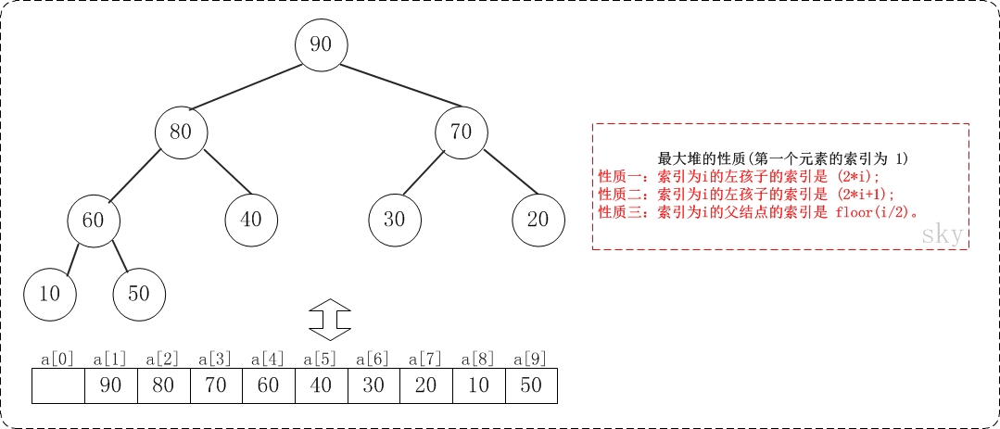
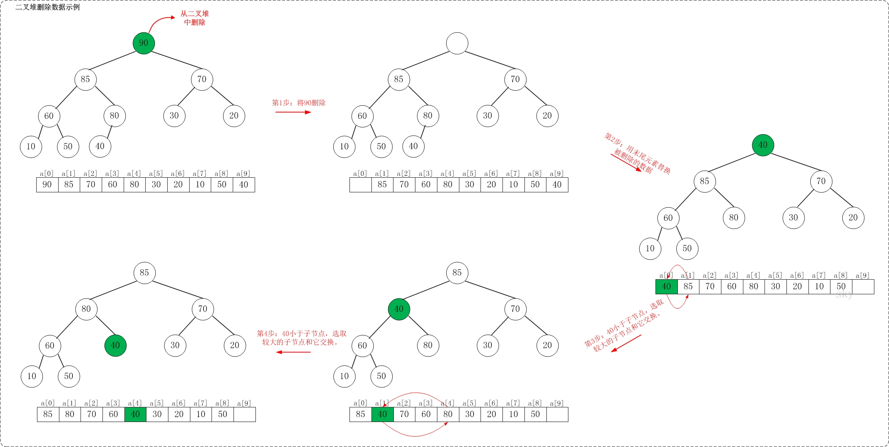

## [二叉堆(二)之 C++的实现][0]
<font face=黑体>
### **概要**

[上一章][1]介绍了堆和二叉堆的基本概念，并通过C语言实现了二叉堆。本章是二叉堆的C++实现。

**目录**  
[1. 二叉堆的介绍][2]   
[2. 二叉堆的图文解析][3]   
[3. 二叉堆的C++实现(完整源码)][4]   
[4. 二叉堆的C++测试程序][5]

转载请注明出处：[http://www.cnblogs.com/skywang12345/p/3610382.html][0]

- - -

**更多内容：** [数据结构与算法系列 目录][6]

(01) [二叉堆(一)之 图文解析 和 C语言的实现][1]   
(02) [二叉堆(二)之 C++的实现][0]   
(03) [二叉堆(三)之 Java的实][7]

### **二叉堆的介绍**

二叉堆是完全二元树或者是近似完全二元树，按照数据的排列方式可以分为两种： 最大堆 和 最小堆 。   
最大堆：父结点的键值总是大于或等于任何一个子节点的键值；最小堆：父结点的键值总是小于或等于任何一个子节点的键值。示意图如下：


二叉堆一般都通过"数组"来实现。数组实现的二叉堆，父节点和子节点的位置存在一定的关系。有时候，我们将"二叉堆的第一个元素"放在数组索引0的位置，有时候放在1的位置。当然，它们的本质一样(都是二叉堆)，只是实现上稍微有一丁点区别。   
假设"第一个元素"在数组中的索引为 0 的话，则父节点和子节点的位置关系如下：   
<font face=楷体>
(01) 索引为i的左孩子的索引是 (2\*i+1);   
(02) 索引为i的左孩子的索引是 (2\*i+2);   
(03) 索引为i的父结点的索引是 floor((i-1)/2);</font>


假设"第一个元素"在数组中的索引为 1 的话，则父节点和子节点的位置关系如下：   
<font face=楷体>
(01) 索引为i的左孩子的索引是 (2\*i);   
(02) 索引为i的左孩子的索引是 (2\*i+1);   
(03) 索引为i的父结点的索引是 floor(i/2);</font>



注意：本文二叉堆的实现统统都是采用"二叉堆第一个元素在数组索引为0"的方式！

### **二叉堆的图文解析**

图文解析是以"最大堆"来进行介绍的。

**1. 基本定义**

 
```cpp

    template <class T>
    class MaxHeap{
        private:
            T *mHeap;        // 数据
            int mCapacity;    // 总的容量
            int mSize;        // 实际容量
    
        private:
            // 最大堆的向下调整算法
            void filterdown(int start, int end);
            // 最大堆的向上调整算法(从start开始向上直到0，调整堆)
            void filterup(int start);
        public:
            MaxHeap();
            MaxHeap(int capacity);
            ~MaxHeap();
    
            // 返回data在二叉堆中的索引
            int getIndex(T data);
            // 删除最大堆中的data
            int remove(T data);
            // 将data插入到二叉堆中
            int insert(T data);
            // 打印二叉堆
            void print();
    };
```

MaxHeap是最大堆的对应的类。 它包括的核心内容是"添加"和"删除"，理解这两个算法，二叉堆也就基本掌握了。下面对它们进行介绍。

**2. 添加**

假设在最大堆[90,80,70,60,40,30,20,10,50]种添加85，需要执行的步骤如下：


_如上图所示，当向最大堆中添加数据时：先将数据加入到最大堆的最后，然后尽可能把这个元素往上挪，直到挪不动为止！_  
将85添加到[90,80,70,60,40,30,20,10,50]中后，最大堆变成了[90,85,70,60,80,30,20,10,50,40]。

**最大堆的插入代码(C++语言)**

 
```cpp

    /*
     * 最大堆的向上调整算法(从start开始向上直到0，调整堆)
     *
     * 注：数组实现的堆中，第N个节点的左孩子的索引值是(2N+1)，右孩子的索引是(2N+2)。
     *
     * 参数说明：
     *     start -- 被上调节点的起始位置(一般为数组中最后一个元素的索引)
     */
    template <class T>
    void MaxHeap<T>::filterup(int start)
    {
        int c = start;            // 当前节点(current)的位置
        int p = (c-1)/2;        // 父(parent)结点的位置 
        T tmp = mHeap[c];        // 当前节点(current)的大小
    
        while(c > 0)
        {
            if(mHeap[p] >= tmp)
                break;
            else
            {
                mHeap[c] = mHeap[p];
                c = p;
                p = (p-1)/2;   
            }       
        }
        mHeap[c] = tmp;
    }
      
    /* 
     * 将data插入到二叉堆中
     *
     * 返回值：
     *     0，表示成功
     *    -1，表示失败
     */
    template <class T>
    int MaxHeap<T>::insert(T data)
    {
        // 如果"堆"已满，则返回
        if(mSize == mCapacity)
            return -1;
     
        mHeap[mSize] = data;        // 将"数组"插在表尾
        filterup(mSize);    // 向上调整堆
        mSize++;                    // 堆的实际容量+1
    
        return 0;
    }

```

insert(data)的作用：将数据data添加到最大堆中。 当堆已满的时候，添加失败；否则data添加到最大堆的末尾。然后通过上调算法重新调整数组，使之重新成为最大堆。

**3. 删除**

假设从最大堆[90,85,70,60,80,30,20,10,50,40]中删除90，需要执行的步骤如下：



_如上图所示，当从最大堆中删除数据时：先删除该数据，然后用最大堆中最后一个的元素插入这个空位；接着，把这个“空位”尽量往上挪，直到剩余的数据变成一个最大堆。_  
从[90,85,70,60,80,30,20,10,50,40]删除90之后，最大堆变成了[85,80,70,60,40,30,20,10,50]。

  
注意：考虑从最大堆[90,85,70,60,80,30,20,10,50,40]中删除60，执行的步骤不能单纯的用它的字节点来替换；而必须考虑到"替换后的树仍然要是最大堆"！


最大堆的删除代码(C++语言)

 

```cpp

    /* 
     * 最大堆的向下调整算法
     *
     * 注：数组实现的堆中，第N个节点的左孩子的索引值是(2N+1)，右孩子的索引是(2N+2)。
     *
     * 参数说明：
     *     start -- 被下调节点的起始位置(一般为0，表示从第1个开始)
     *     end   -- 截至范围(一般为数组中最后一个元素的索引)
     */
    template <class T>
    void MaxHeap<T>::filterdown(int start, int end)
    {
        int c = start;          // 当前(current)节点的位置
        int l = 2*c + 1;     // 左(left)孩子的位置
        T tmp = mHeap[c];    // 当前(current)节点的大小
    
        while(l <= end)
        {
            // "l"是左孩子，"l+1"是右孩子
            if(l < end && mHeap[l] < mHeap[l+1])
                l++;        // 左右两孩子中选择较大者，即mHeap[l+1]
            if(tmp >= mHeap[l])
                break;        //调整结束
            else
            {
                mHeap[c] = mHeap[l];
                c = l;
                l = 2*l + 1;   
            }       
        }   
        mHeap[c] = tmp;
    }
    
    /*
     * 删除最大堆中的data
     *
     * 返回值：
     *      0，成功
     *     -1，失败
     */
    template <class T>
    int MaxHeap<T>::remove(T data)
    {
        int index;
        // 如果"堆"已空，则返回-1
        if(mSize == 0)
            return -1;
    
        // 获取data在数组中的索引
        index = getIndex(data); 
        if (index==-1)
            return -1;
    
        mHeap[index] = mHeap[--mSize];    // 用最后元素填补
        filterdown(index, mSize-1);        // 从index位置开始自上向下调整为最大堆
    
        return 0;
    }
```

### **二叉堆的C++实现(完整源码)**

二叉堆的实现同时包含了"最大堆"和"最小堆"。   
二叉堆(最大堆)的实现文件(MaxHeap.cpp)

```cpp
/**
 * 二叉堆(最大堆)
 *
 * @author skywang
 * @date 2014/03/07
 */

#include <iomanip>
#include <iostream>
using namespace std;

template <class T>
class MaxHeap{
    private:
        T *mHeap;        // 数据
        int mCapacity;    // 总的容量
        int mSize;        // 实际容量

    private:
        // 最大堆的向下调整算法
        void filterdown(int start, int end);
        // 最大堆的向上调整算法(从start开始向上直到0，调整堆)
        void filterup(int start);
    public:
        MaxHeap();
        MaxHeap(int capacity);
        ~MaxHeap();

        // 返回data在二叉堆中的索引
        int getIndex(T data);
        // 删除最大堆中的data
        int remove(T data);
        // 将data插入到二叉堆中
        int insert(T data);
        // 打印二叉堆
        void print();
};

/* 
 * 构造函数
 */
template <class T>
MaxHeap<T>::MaxHeap()
{
    new (this)MaxHeap(30);
}

template <class T>
MaxHeap<T>::MaxHeap(int capacity)
{
    mSize = 0;
    mCapacity = capacity;
    mHeap = new T[mCapacity];
}
/* 
 * 析构函数
 */
template <class T>
MaxHeap<T>::~MaxHeap() 
{
    mSize = 0;
    mCapacity = 0;
    delete[] mHeap;
}

/* 
 * 返回data在二叉堆中的索引
 *
 * 返回值：
 *     存在 -- 返回data在数组中的索引
 *     不存在 -- -1
 */
template <class T>
int MaxHeap<T>::getIndex(T data)
{
    for(int i=0; i<mSize; i++)
        if (data==mHeap[i])
            return i;

    return -1;
}

/* 
 * 最大堆的向下调整算法
 *
 * 注：数组实现的堆中，第N个节点的左孩子的索引值是(2N+1)，右孩子的索引是(2N+2)。
 *
 * 参数说明：
 *     start -- 被下调节点的起始位置(一般为0，表示从第1个开始)
 *     end   -- 截至范围(一般为数组中最后一个元素的索引)
 */
template <class T>
void MaxHeap<T>::filterdown(int start, int end)
{
    int c = start;          // 当前(current)节点的位置
    int l = 2*c + 1;     // 左(left)孩子的位置
    T tmp = mHeap[c];    // 当前(current)节点的大小

    while(l <= end)
    {
        // "l"是左孩子，"l+1"是右孩子
        if(l < end && mHeap[l] < mHeap[l+1])
            l++;        // 左右两孩子中选择较大者，即mHeap[l+1]
        if(tmp >= mHeap[l])
            break;        //调整结束
        else
        {
            mHeap[c] = mHeap[l];
            c = l;
            l = 2*l + 1;   
        }       
    }   
    mHeap[c] = tmp;
}

/*
 * 删除最大堆中的data
 *
 * 返回值：
 *      0，成功
 *     -1，失败
 */
template <class T>
int MaxHeap<T>::remove(T data)
{
    int index;
    // 如果"堆"已空，则返回-1
    if(mSize == 0)
        return -1;

    // 获取data在数组中的索引
    index = getIndex(data); 
    if (index==-1)
        return -1;

    mHeap[index] = mHeap[--mSize];    // 用最后元素填补
    filterdown(index, mSize-1);        // 从index位置开始自上向下调整为最大堆

    return 0;
}

/*
 * 最大堆的向上调整算法(从start开始向上直到0，调整堆)
 *
 * 注：数组实现的堆中，第N个节点的左孩子的索引值是(2N+1)，右孩子的索引是(2N+2)。
 *
 * 参数说明：
 *     start -- 被上调节点的起始位置(一般为数组中最后一个元素的索引)
 */
template <class T>
void MaxHeap<T>::filterup(int start)
{
    int c = start;            // 当前节点(current)的位置
    int p = (c-1)/2;        // 父(parent)结点的位置 
    T tmp = mHeap[c];        // 当前节点(current)的大小

    while(c > 0)
    {
        if(mHeap[p] >= tmp)
            break;
        else
        {
            mHeap[c] = mHeap[p];
            c = p;
            p = (p-1)/2;   
        }       
    }
    mHeap[c] = tmp;
}
  
/* 
 * 将data插入到二叉堆中
 *
 * 返回值：
 *     0，表示成功
 *    -1，表示失败
 */
template <class T>
int MaxHeap<T>::insert(T data)
{
    // 如果"堆"已满，则返回
    if(mSize == mCapacity)
        return -1;
 
    mHeap[mSize] = data;        // 将"数组"插在表尾
    filterup(mSize);    // 向上调整堆
    mSize++;                    // 堆的实际容量+1

    return 0;
}
  
/* 
 * 打印二叉堆
 *
 * 返回值：
 *     0，表示成功
 *    -1，表示失败
 */
template <class T>
void MaxHeap<T>::print()
{
    for (int i=0; i<mSize; i++)
        cout << mHeap[i] << " ";
}
    
int main()
{
    int a[] = {10, 40, 30, 60, 90, 70, 20, 50, 80};
    int i, len=(sizeof(a)) / (sizeof(a[0])) ;
    MaxHeap<int>* tree=new MaxHeap<int>();

    cout << "== 依次添加: ";
    for(i=0; i<len; i++)
    {
        cout << a[i] <<" ";
        tree->insert(a[i]);
    }

    cout << "\n== 最 大 堆: ";
    tree->print();

    i=85;
    tree->insert(i);
    cout << "\n== 添加元素: " << i;
    cout << "\n== 最 大 堆: ";
    tree->print();

    i=90;
    tree->remove(i);
    cout << "\n== 删除元素: " << i;
    cout << "\n== 最 大 堆: ";
    tree->print();
    cout << endl; 

    return 0;
}
```

二叉堆(最小堆)的实现文件(MinHeap.cpp)

```cpp
/**
 * 二叉堆(最小堆)
 *
 * @author skywang
 * @date 2014/03/07
 */

#include <iomanip>
#include <iostream>
using namespace std;

template <class T>
class MinHeap{
    private:
        T *mHeap;        // 数据
        int mCapacity;    // 总的容量
        int mSize;        // 实际容量

    private:
        // 最小堆的向下调整算法
        void filterdown(int start, int end);
        // 最小堆的向上调整算法(从start开始向上直到0，调整堆)
        void filterup(int start);
    public:
        MinHeap();
        MinHeap(int capacity);
        ~MinHeap();

        // 返回data在二叉堆中的索引
        int getIndex(T data);
        // 删除最小堆中的data
        int remove(T data);
        // 将data插入到二叉堆中
        int insert(T data);
        // 打印二叉堆
        void print();
};

/* 
 * 构造函数
 */
template <class T>
MinHeap<T>::MinHeap()
{
    new (this)MinHeap(30);
}

template <class T>
MinHeap<T>::MinHeap(int capacity)
{
    mSize = 0;
    mCapacity = capacity;
    mHeap = new T[mCapacity];
}
/* 
 * 析构函数
 */
template <class T>
MinHeap<T>::~MinHeap() 
{
    mSize = 0;
    mCapacity = 0;
    delete[] mHeap;
}

/* 
 * 返回data在二叉堆中的索引
 *
 * 返回值：
 *     存在 -- 返回data在数组中的索引
 *     不存在 -- -1
 */
template <class T>
int MinHeap<T>::getIndex(T data)
{
    for(int i=0; i<mSize; i++)
        if (data==mHeap[i])
            return i;

    return -1;
}

/* 
 * 最小堆的向下调整算法
 *
 * 注：数组实现的堆中，第N个节点的左孩子的索引值是(2N+1)，右孩子的索引是(2N+2)。
 *
 * 参数说明：
 *     start -- 被下调节点的起始位置(一般为0，表示从第1个开始)
 *     end   -- 截至范围(一般为数组中最后一个元素的索引)
 */
template <class T>
void MinHeap<T>::filterdown(int start, int end)
{
    int c = start;          // 当前(current)节点的位置
    int l = 2*c + 1;     // 左(left)孩子的位置
    T tmp = mHeap[c];    // 当前(current)节点的大小

    while(l <= end)
    {
        // "l"是左孩子，"l+1"是右孩子
        if(l < end && mHeap[l] > mHeap[l+1])
            l++;        // 左右两孩子中选择较小者，即mHeap[l+1]
        if(tmp <= mHeap[l])
            break;        //调整结束
        else
        {
            mHeap[c] = mHeap[l];
            c = l;
            l = 2*l + 1;   
        }       
    }   
    mHeap[c] = tmp;
}
 
/*
 * 删除最小堆中的data
 *
 * 返回值：
 *      0，成功
 *     -1，失败
 */
template <class T>
int MinHeap<T>::remove(T data)
{
    int index;
    // 如果"堆"已空，则返回-1
    if(mSize == 0)
        return -1;

    // 获取data在数组中的索引
    index = getIndex(data); 
    if (index==-1)
        return -1;

    mHeap[index] = mHeap[--mSize];        // 用最后元素填补
    filterdown(index, mSize-1);    // 从index号位置开始自上向下调整为最小堆

    return 0;
}

/*
 * 最小堆的向上调整算法(从start开始向上直到0，调整堆)
 *
 * 注：数组实现的堆中，第N个节点的左孩子的索引值是(2N+1)，右孩子的索引是(2N+2)。
 *
 * 参数说明：
 *     start -- 被上调节点的起始位置(一般为数组中最后一个元素的索引)
 */
template <class T>
void MinHeap<T>::filterup(int start)
{
    int c = start;            // 当前节点(current)的位置
    int p = (c-1)/2;        // 父(parent)结点的位置 
    T tmp = mHeap[c];        // 当前节点(current)的大小

    while(c > 0)
    {
        if(mHeap[p] <= tmp)
            break;
        else
        {
            mHeap[c] = mHeap[p];
            c = p;
            p = (p-1)/2;   
        }       
    }
    mHeap[c] = tmp;
}
  
/* 
 * 将data插入到二叉堆中
 *
 * 返回值：
 *     0，表示成功
 *    -1，表示失败
 */
template <class T>
int MinHeap<T>::insert(T data)
{
    // 如果"堆"已满，则返回
    if(mSize == mCapacity)
        return -1;
 
    mHeap[mSize] = data;        // 将"数组"插在表尾
    filterup(mSize);            // 向上调整堆
    mSize++;                    // 堆的实际容量+1

    return 0;
}
  
/* 
 * 打印二叉堆
 *
 * 返回值：
 *     0，表示成功
 *    -1，表示失败
 */
template <class T>
void MinHeap<T>::print()
{
    for (int i=0; i<mSize; i++)
        cout << mHeap[i] << " ";
}

int main()
{
    int a[] = {80, 40, 30, 60, 90, 70, 10, 50, 20};
    int i, len=(sizeof(a)) / (sizeof(a[0])) ;
    MinHeap<int>* tree=new MinHeap<int>();

    cout << "== 依次添加: ";
    for(i=0; i<len; i++)
    {
        cout << a[i] <<" ";
        tree->insert(a[i]);
    }

    cout << "\n== 最 小 堆: ";
    tree->print();

    i=15;
    tree->insert(i);
    cout << "\n== 添加元素: " << i;
    cout << "\n== 最 小 堆: ";
    tree->print();

    i=10;
    tree->remove(i);
    cout << "\n== 删除元素: " << i;
    cout << "\n== 最 小 堆: ";
    tree->print();
    cout << endl; 

    return 0;
}
```

### **二叉堆的C++测试程序**

测试程序已经包含在相应的实现文件(MaxHeap.cpp)中了，下面只列出程序运行结果。

最大堆(MaxHeap.cpp)的运行结果：

    == 依次添加: 10 40 30 60 90 70 20 50 80 
    == 最 大 堆: 90 80 70 60 40 30 20 10 50 
    == 添加元素: 85
    == 最 大 堆: 90 85 70 60 80 30 20 10 50 40 
    == 删除元素: 90
    == 最 大 堆: 85 80 70 60 40 30 20 10 50

最小堆(MinHeap.cpp)的运行结果：

    == 依次添加: 80 40 30 60 90 70 10 50 20 
    == 最 小 堆: 10 20 30 50 90 70 40 80 60 
    == 添加元素: 15
    == 最 小 堆: 10 15 30 50 20 70 40 80 60 90 
    == 删除元素: 10
    == 最 小 堆: 15 20 30 50 90 70 40 80 60

PS. 二叉堆是"堆排序"的理论基石。 以后讲解算法时会讲解到"堆排序"，理解了"二叉堆"之后，"堆排序"就很简单了。

</font>

[0]: http://www.cnblogs.com/skywang12345/p/3610382.html
[1]: http://www.cnblogs.com/skywang12345/p/3610187.html
[2]: #a1
[3]: #a2
[4]: #a3
[5]: #a4
[6]: http://www.cnblogs.com/skywang12345/p/3603935.html
[7]: http://www.cnblogs.com/skywang12345/p/3610390.html
