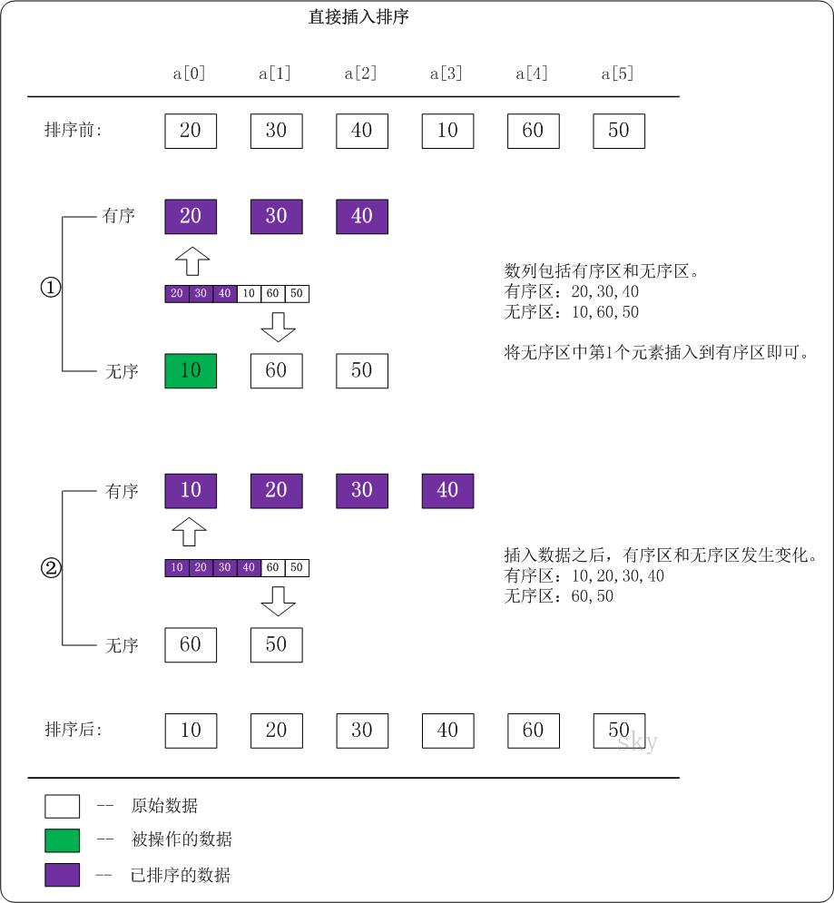

## [直接插入排序][0]
<font face=黑体>
### **概要**

本章介绍排序算法中的直接插入排序。内容包括：   
1. [直接插入排序介绍][1]   
2. [直接插入排序图文说明][2]   
3. [直接插入排序的时间复杂度和稳定性][3]   
4. [直接插入排序实现][4]   
4.1 [直接插入排序C实现][5]   
4.2 [直接插入排序C++实现][6]   
4.3 [直接插入排序Java实现][7]

转载请注明出处：[http://www.cnblogs.com/skywang12345/p/3596881.html][0]

- - -

**更多内容：** [数据结构与算法系列 目录][8]

### **直接插入排序介绍**

直接插入排序(Straight Insertion Sort)的基本思想是：把n个待排序的元素看成为一个有序表和一个无序表。开始时有序表中只包含1个元素，无序表中包含有n-1个元素，排序过程中每次从无序表中取出第一个元素，将它插入到有序表中的适当位置，使之成为新的有序表，重复n-1次可完成排序过程。

### **直接插入排序图文说明**

**直接插入排序代码**

```c
    /*
     * 直接插入排序
     *
     * 参数说明：
     *     a -- 待排序的数组
     *     n -- 数组的长度
     */
    void insert_sort(int a[], int n)
    {
        int i, j, k;
    
        for (i = 1; i < n; i++)
        {
            //为a[i]在前面的a[0...i-1]有序区间中找一个合适的位置
            for (j = i - 1; j >= 0; j--)
                if (a[j] < a[i])
                    break;
    
            //如找到了一个合适的位置
            if (j != i - 1)
            {
                //将比a[i]大的数据向后移
                int temp = a[i];
                for (k = i - 1; k > j; k--)
                    a[k + 1] = a[k];
                //将a[i]放到正确位置上
                a[k + 1] = temp;
            }
        }
    }
```

下面选取直接插入排序的一个中间过程对其进行说明。假设{20,30,40,10,60,50}中的前3个数已经排列过，是有序的了；接下来对10进行排列。示意图如下：



图中将数列分为有序区和无序区。我们需要做的工作只有两个：(1)取出无序区中的第1个数，并找出它在有序区对应的位置。(2)将无序区的数据插入到有序区；若有必要的话，则对有序区中的相关数据进行移位。

### **直接插入排序的时间复杂度和稳定性**

**直接插入排序时间复杂度**  
直接插入排序的时间复杂度是 **O(N<sup>2</sup>)**。   
假设被排序的数列中有N个数。遍历一趟的时间复杂度是O(N)，需要遍历多少次呢？N-1！因此，直接插入排序的时间复杂度是O(N<sup>2</sup>)。

**直接插入排序稳定性**  
直接插入排序是稳定的算法，它满足稳定算法的定义。   
算法稳定性 -- 假设在数列中存在`a[i]=a[j]`，若在排序之前，`a[i]在a[j]`前面；并且排序之后，`a[i]`仍然在`a[j]`前面。则这个排序算法是稳定的！

### **直接插入排序实现**

**直接插入排序C实现**  
实现代码(insert_sort.c)

```c
/**
 * 直接插入排序：C 语言
 *
 * @author skywang
 * @date 2014/03/11
 */

#include <stdio.h>

// 数组长度
#define LENGTH(array) ( (sizeof(array)) / (sizeof(array[0])) )

/*
 * 直接插入排序
 *
 * 参数说明：
 *     a -- 待排序的数组
 *     n -- 数组的长度
 */
void insert_sort(int a[], int n)
{
    int i, j, k;

    for (i = 1; i < n; i++)
    {
        //为a[i]在前面的a[0...i-1]有序区间中找一个合适的位置
        for (j = i - 1; j >= 0; j--)
            if (a[j] < a[i])
                break;

        //如找到了一个合适的位置
        if (j != i - 1)
        {
            //将比a[i]大的数据向后移
            int temp = a[i];
            for (k = i - 1; k > j; k--)
                a[k + 1] = a[k];
            //将a[i]放到正确位置上
            a[k + 1] = temp;
        }
    }
}

void main()
{
    int i;
    int a[] = {20,40,30,10,60,50};
    int ilen = LENGTH(a);

    printf("before sort:");
    for (i=0; i<ilen; i++)
        printf("%d ", a[i]);
    printf("\n");

    insert_sort(a, ilen);

    printf("after  sort:");
    for (i=0; i<ilen; i++)
        printf("%d ", a[i]);
    printf("\n");
}
```

**直接插入排序C++实现**  
实现代码(InsertSort.cpp)

```cpp
/**
 * 直接插入排序：C++
 *
 * @author skywang
 * @date 2014/03/11
 */

#include <iostream>
using namespace std;

/*
 * 直接插入排序
 *
 * 参数说明：
 *     a -- 待排序的数组
 *     n -- 数组的长度
 */
void insertSort(int* a, int n)
{
    int i, j, k;

    for (i = 1; i < n; i++)
    {
        //为a[i]在前面的a[0...i-1]有序区间中找一个合适的位置
        for (j = i - 1; j >= 0; j--)
            if (a[j] < a[i])
                break;

        //如找到了一个合适的位置
        if (j != i - 1)
        {
            //将比a[i]大的数据向后移
            int temp = a[i];
            for (k = i - 1; k > j; k--)
                a[k + 1] = a[k];
            //将a[i]放到正确位置上
            a[k + 1] = temp;
        }
    }
}

int main()
{
    int i;
    int a[] = {20,40,30,10,60,50};
    int ilen = (sizeof(a)) / (sizeof(a[0]));

    cout << "before sort:";
    for (i=0; i<ilen; i++)
        cout << a[i] << " ";
    cout << endl;

    insertSort(a, ilen);

    cout << "after  sort:";
    for (i=0; i<ilen; i++)
        cout << a[i] << " ";
    cout << endl;

    return 0;
}
```

**直接插入排序Java实现**  
实现代码(InsertSort.java)

```java
/**
 * 直接插入排序：Java
 *
 * @author skywang
 * @date 2014/03/11
 */

public class InsertSort {

    /*
     * 直接插入排序
     *
     * 参数说明：
     *     a -- 待排序的数组
     *     n -- 数组的长度
     */
    public static void insertSort(int[] a, int n) {
        int i, j, k;

        for (i = 1; i < n; i++) {

            //为a[i]在前面的a[0...i-1]有序区间中找一个合适的位置
            for (j = i - 1; j >= 0; j--)
                if (a[j] < a[i])
                    break;

            //如找到了一个合适的位置
            if (j != i - 1) {
                //将比a[i]大的数据向后移
                int temp = a[i];
                for (k = i - 1; k > j; k--)
                    a[k + 1] = a[k];
                //将a[i]放到正确位置上
                a[k + 1] = temp;
            }
        }
    }

    public static void main(String[] args) {
        int i;
        int[] a = {20,40,30,10,60,50};

        System.out.printf("before sort:");
        for (i=0; i<a.length; i++)
            System.out.printf("%d ", a[i]);
        System.out.printf("\n");

        insertSort(a, a.length);

        System.out.printf("after  sort:");
        for (i=0; i<a.length; i++)
            System.out.printf("%d ", a[i]);
        System.out.printf("\n");
    }
}
```

上面3种实现的原理和输出结果都是一样的。下面是它们的输出结果：

    before sort:20 40 30 10 60 50 
    after  sort:10 20 30 40 50 60

</font>

[0]: http://www.cnblogs.com/skywang12345/p/3596881.html
[1]: #a1
[2]: #a2
[3]: #a3
[4]: #a4
[5]: #a41
[6]: #a42
[7]: #a43
[8]: http://www.cnblogs.com/skywang12345/p/3603935.html