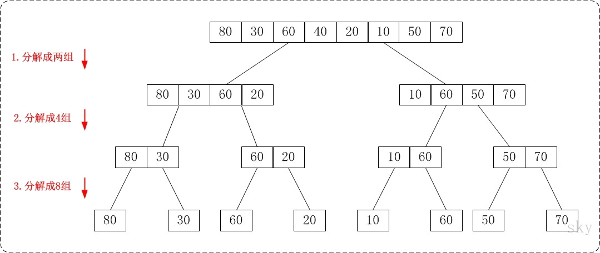
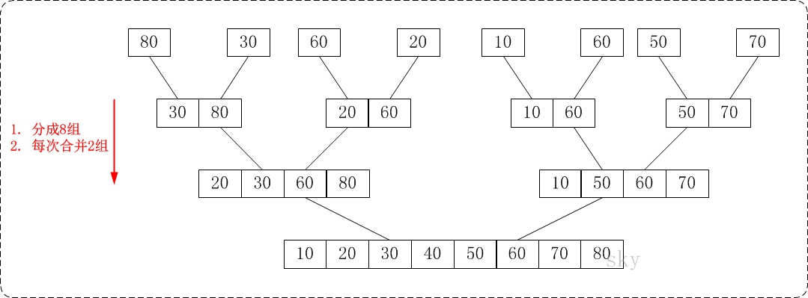

## [归并排序][0]
<font face=黑体>
### **概要**

本章介绍排序算法中的归并排序。内容包括：   
1. [归并排序介绍][1]   
2. [归并排序图文说明][2]   
3. [归并排序的时间复杂度和稳定性][3]   
4. [归并排序实现][4]   
4.1 [归并排序C实现][5]   
4.2 [归并排序C++实现][6]   
4.3 [归并排序Java实现][7]

转载请注明出处：[http://www.cnblogs.com/skywang12345/p/3602369.html][0]

- - -

**更多排序和算法请参考：** [数据结构与算法系列 目录][8]

### **归并排序介绍**

将两个的有序数列合并成一个有序数列，我们称之为"**归并**"。   
归并排序(Merge Sort)就是利用归并思想对数列进行排序。根据具体的实现，归并排序包括"**从上往下**"和"**从下往上**"2种方式。

  
1. **从下往上的归并排序**：将待排序的数列分成若干个长度为1的子数列，然后将这些数列两两合并；得到若干个长度为2的有序数列，再将这些数列两两合并；得到若干个长度为4的有序数列，再将它们两两合并；直接合并成一个数列为止。这样就得到了我们想要的排序结果。(参考下面的图片)

2.**从上往下的归并排序**：它与"从下往上"在排序上是反方向的。它基本包括3步：   
① 分解 -- 将当前区间一分为二，即求分裂点 `mid = (low + high)/2`;   
② 求解 -- 递归地对两个子区间`a[low...mid]` 和 `a[mid+1...high]`进行归并排序。递归的终结条件是子区间长度为1。   
③ 合并 -- 将已排序的两个子区间`a[low...mid]`和 `a[mid+1...high]`归并为一个有序的区间`a[low...high]`。

下面的图片很清晰的反映了"从下往上"和"从上往下"的归并排序的区别。


### **归并排序图文说明**

归并排序(从上往下)代码

```c
    /*
     * 将一个数组中的两个相邻有序区间合并成一个
     *
     * 参数说明：
     *     a -- 包含两个有序区间的数组
     *     start -- 第1个有序区间的起始地址。
     *     mid   -- 第1个有序区间的结束地址。也是第2个有序区间的起始地址。
     *     end   -- 第2个有序区间的结束地址。
     */
    void merge(int a[], int start, int mid, int end)
    {
        int *tmp = (int *)malloc((end-start+1)*sizeof(int));    // tmp是汇总2个有序区的临时区域
        int i = start;            // 第1个有序区的索引
        int j = mid + 1;        // 第2个有序区的索引
        int k = 0;                // 临时区域的索引
    
        while(i <= mid && j <= end)
        {
            if (a[i] <= a[j])
                tmp[k++] = a[i++];
            else
                tmp[k++] = a[j++];
        }
    
        while(i <= mid)
            tmp[k++] = a[i++];
    
        while(j <= end)
            tmp[k++] = a[j++];
    
        // 将排序后的元素，全部都整合到数组a中。
        for (i = 0; i < k; i++)
            a[start + i] = tmp[i];
    
        free(tmp);
    }
    
    /*
     * 归并排序(从上往下)
     *
     * 参数说明：
     *     a -- 待排序的数组
     *     start -- 数组的起始地址
     *     endi -- 数组的结束地址
     */
    void merge_sort_up2down(int a[], int start, int end)
    {
        if(a==NULL || start >= end)
            return ;
    
        int mid = (end + start)/2;
        merge_sort_up2down(a, start, mid); // 递归排序a[start...mid]
        merge_sort_up2down(a, mid+1, end); // 递归排序a[mid+1...end]
    
        // a[start...mid] 和 a[mid...end]是两个有序空间，
        // 将它们排序成一个有序空间a[start...end]
        merge(a, start, mid, end);
    }
```

  
从上往下的归并排序采用了递归的方式实现。它的原理非常简单，如下图：



通过"从上往下的归并排序"来对数组{80,30,60,40,20,10,50,70}进行排序时：   
1. 将数组{80,30,60,40,20,10,50,70}看作由两个有序的子数组{80,30,60,40}和{20,10,50,70}组成。对两个有序子树组进行排序即可。   
2. 将子数组{80,30,60,40}看作由两个有序的子数组{80,30}和{60,40}组成。   
将子数组{20,10,50,70}看作由两个有序的子数组{20,10}和{50,70}组成。   
3. 将子数组{80,30}看作由两个有序的子数组{80}和{30}组成。   
将子数组{60,40}看作由两个有序的子数组{60}和{40}组成。   
将子数组{20,10}看作由两个有序的子数组{20}和{10}组成。   
将子数组{50,70}看作由两个有序的子数组{50}和{70}组成。

**归并排序(从下往上)代码**

```c
    /*
     * 对数组a做若干次合并：数组a的总长度为len，将它分为若干个长度为gap的子数组；
     *             将"每2个相邻的子数组" 进行合并排序。
     *
     * 参数说明：
     *     a -- 待排序的数组
     *     len -- 数组的长度
     *     gap -- 子数组的长度
     */
    void merge_groups(int a[], int len, int gap)
    {
        int i;
        int twolen = 2 * gap;    // 两个相邻的子数组的长度
    
        // 将"每2个相邻的子数组" 进行合并排序。
        for(i = 0; i+2*gap-1 < len; i+=(2*gap))
        {
            merge(a, i, i+gap-1, i+2*gap-1);
        }
    
        // 若 i+gap-1 < len-1，则剩余一个子数组没有配对。
        // 将该子数组合并到已排序的数组中。
        if ( i+gap-1 < len-1)
        {
            merge(a, i, i + gap - 1, len - 1);
        }
    }
    
    /*
     * 归并排序(从下往上)
     *
     * 参数说明：
     *     a -- 待排序的数组
     *     len -- 数组的长度
     */
    void merge_sort_down2up(int a[], int len)
    {
        int n;
    
        if (a==NULL || len<=0)
            return ;
    
        for(n = 1; n < len; n*=2)
            merge_groups(a, len, n);
    }
```

从下往上的归并排序的思想正好与"从下往上的归并排序"相反。如下图：



通过"从下往上的归并排序"来对数组{80,30,60,40,20,10,50,70}进行排序时：   
1. 将数组{80,30,60,40,20,10,50,70}看作由8个有序的子数组{80},{30},{60},{40},{20},{10},{50}和{70}组成。   
2. 将这8个有序的子数列两两合并。得到4个有序的子树列{30,80},{40,60},{10,20}和{50,70}。   
3. 将这4个有序的子数列两两合并。得到2个有序的子树列{30,40,60,80}和{10,20,50,70}。   
4. 将这2个有序的子数列两两合并。得到1个有序的子树列{10,20,30,40,50,60,70,80}。

### **归并排序的时间复杂度和稳定性**

**归并排序时间复杂度**  

归并排序的时间复杂度是O(N\*lgN)。   
假设被排序的数列中有N个数。遍历一趟的时间复杂度是O(N)，需要遍历多少次呢？   
归并排序的形式就是一棵二叉树，它需要遍历的次数就是二叉树的深度，而根据完全二叉树的可以得出它的时间复杂度是O(N\*lgN)。

**归并排序稳定性**  
归并排序是稳定的算法，它满足稳定算法的定义。   
_算法稳定性 -- 假设在数列中存在`a[i]=a[j]`，若在排序之前，`a[i]`在`a[j]`前面；并且排序之后，`a[i]`仍然在`a[j]`前面。则这个排序算法是稳定的！_

### **归并排序实现**

下面给出归并排序的三种实现：C、C++和Java。这三种实现的原理和输出结果都是一样的，每一种实现中都包括了"从上往下的归并排序"和"从下往上的归并排序"这2种形式。   
**归并排序C实现**  
实现代码(merge_sort.c)

```c
/**
 * 归并排序：C 语言
 *
 * @author skywang
 * @date 2014/03/12
 */

#include <stdio.h>
#include <stdlib.h>

// 数组长度
#define LENGTH(array) ( (sizeof(array)) / (sizeof(array[0])) )

/*
 * 将一个数组中的两个相邻有序区间合并成一个
 *
 * 参数说明：
 *     a -- 包含两个有序区间的数组
 *     start -- 第1个有序区间的起始地址。
 *     mid   -- 第1个有序区间的结束地址。也是第2个有序区间的起始地址。
 *     end   -- 第2个有序区间的结束地址。
 */
void merge(int a[], int start, int mid, int end)
{
    int *tmp = (int *)malloc((end-start+1)*sizeof(int));    // tmp是汇总2个有序区的临时区域
    int i = start;            // 第1个有序区的索引
    int j = mid + 1;        // 第2个有序区的索引
    int k = 0;                // 临时区域的索引

    while(i <= mid && j <= end)
    {
        if (a[i] <= a[j])
            tmp[k++] = a[i++];
        else
            tmp[k++] = a[j++];
    }

    while(i <= mid)
        tmp[k++] = a[i++];

    while(j <= end)
        tmp[k++] = a[j++];

    // 将排序后的元素，全部都整合到数组a中。
    for (i = 0; i < k; i++)
        a[start + i] = tmp[i];

    free(tmp);
}

/*
 * 归并排序(从上往下)
 *
 * 参数说明：
 *     a -- 待排序的数组
 *     start -- 数组的起始地址
 *     endi -- 数组的结束地址
 */
void merge_sort_up2down(int a[], int start, int end)
{
    if(a==NULL || start >= end)
        return ;

    int mid = (end + start)/2;
    merge_sort_up2down(a, start, mid); // 递归排序a[start...mid]
    merge_sort_up2down(a, mid+1, end); // 递归排序a[mid+1...end]

    // a[start...mid] 和 a[mid...end]是两个有序空间，
    // 将它们排序成一个有序空间a[start...end]
    merge(a, start, mid, end);
}


/*
 * 对数组a做若干次合并：数组a的总长度为len，将它分为若干个长度为gap的子数组；
 *             将"每2个相邻的子数组" 进行合并排序。
 *
 * 参数说明：
 *     a -- 待排序的数组
 *     len -- 数组的长度
 *     gap -- 子数组的长度
 */
void merge_groups(int a[], int len, int gap)
{
    int i;
    int twolen = 2 * gap;    // 两个相邻的子数组的长度

    // 将"每2个相邻的子数组" 进行合并排序。
    for(i = 0; i+2*gap-1 < len; i+=(2*gap))
    {
        merge(a, i, i+gap-1, i+2*gap-1);
    }

    // 若 i+gap-1 < len-1，则剩余一个子数组没有配对。
    // 将该子数组合并到已排序的数组中。
    if ( i+gap-1 < len-1)
    {
        merge(a, i, i + gap - 1, len - 1);
    }
}

/*
 * 归并排序(从下往上)
 *
 * 参数说明：
 *     a -- 待排序的数组
 *     len -- 数组的长度
 */
void merge_sort_down2up(int a[], int len)
{
    int n;

    if (a==NULL || len<=0)
        return ;

    for(n = 1; n < len; n*=2)
        merge_groups(a, len, n);
}

void main()
{
    int i;
    int a[] = {80,30,60,40,20,10,50,70};
    int ilen = LENGTH(a);

    printf("before sort:");
    for (i=0; i<ilen; i++)
        printf("%d ", a[i]);
    printf("\n");

    merge_sort_up2down(a, 0, ilen-1);        // 归并排序(从上往下)
    //merge_sort_down2up(a, ilen);            // 归并排序(从下往上)

    printf("after  sort:");
    for (i=0; i<ilen; i++)
        printf("%d ", a[i]);
    printf("\n");
}
```

**归并排序C++实现**  
实现代码(MergeSort.cpp)

```cpp
/**
 * 归并排序：C++
 *
 * @author skywang
 * @date 2014/03/12
 */

#include <iostream>
using namespace std;

/*
 * 将一个数组中的两个相邻有序区间合并成一个
 *
 * 参数说明：
 *     a -- 包含两个有序区间的数组
 *     start -- 第1个有序区间的起始地址。
 *     mid   -- 第1个有序区间的结束地址。也是第2个有序区间的起始地址。
 *     end   -- 第2个有序区间的结束地址。
 */
void merge(int* a, int start, int mid, int end)
{
    int *tmp = new int[end-start+1];    // tmp是汇总2个有序区的临时区域
    int i = start;            // 第1个有序区的索引
    int j = mid + 1;        // 第2个有序区的索引
    int k = 0;                // 临时区域的索引

    while(i <= mid && j <= end)
    {
        if (a[i] <= a[j])
            tmp[k++] = a[i++];
        else
            tmp[k++] = a[j++];
    }

    while(i <= mid)
        tmp[k++] = a[i++];

    while(j <= end)
        tmp[k++] = a[j++];

    // 将排序后的元素，全部都整合到数组a中。
    for (i = 0; i < k; i++)
        a[start + i] = tmp[i];

    delete[] tmp;
}

/*
 * 归并排序(从上往下)
 *
 * 参数说明：
 *     a -- 待排序的数组
 *     start -- 数组的起始地址
 *     endi -- 数组的结束地址
 */
void mergeSortUp2Down(int* a, int start, int end)
{
    if(a==NULL || start >= end)
        return ;

    int mid = (end + start)/2;
    mergeSortUp2Down(a, start, mid); // 递归排序a[start...mid]
    mergeSortUp2Down(a, mid+1, end); // 递归排序a[mid+1...end]

    // a[start...mid] 和 a[mid...end]是两个有序空间，
    // 将它们排序成一个有序空间a[start...end]
    merge(a, start, mid, end);
}


/*
 * 对数组a做若干次合并：数组a的总长度为len，将它分为若干个长度为gap的子数组；
 *             将"每2个相邻的子数组" 进行合并排序。
 *
 * 参数说明：
 *     a -- 待排序的数组
 *     len -- 数组的长度
 *     gap -- 子数组的长度
 */
void mergeGroups(int* a, int len, int gap)
{
    int i;
    int twolen = 2 * gap;    // 两个相邻的子数组的长度

    // 将"每2个相邻的子数组" 进行合并排序。
    for(i = 0; i+2*gap-1 < len; i+=(2*gap))
    {
        merge(a, i, i+gap-1, i+2*gap-1);
    }

    // 若 i+gap-1 < len-1，则剩余一个子数组没有配对。
    // 将该子数组合并到已排序的数组中。
    if ( i+gap-1 < len-1)
    {
        merge(a, i, i + gap - 1, len - 1);
    }
}

/*
 * 归并排序(从下往上)
 *
 * 参数说明：
 *     a -- 待排序的数组
 *     len -- 数组的长度
 */
void mergeSortDown2Up(int* a, int len)
{
    int n;

    if (a==NULL || len<=0)
        return ;

    for(n = 1; n < len; n*=2)
        mergeGroups(a, len, n);
}

int main()
{
    int i;
    int a[] = {80,30,60,40,20,10,50,70};
    int ilen = (sizeof(a)) / (sizeof(a[0]));

    cout << "before sort:";
    for (i=0; i<ilen; i++)
        cout << a[i] << " ";
    cout << endl;

    mergeSortUp2Down(a, 0, ilen-1);        // 归并排序(从上往下)
    //mergeSortDown2Up(a, ilen);            // 归并排序(从下往上)

    cout << "after  sort:";
    for (i=0; i<ilen; i++)
        cout << a[i] << " ";
    cout << endl;

    return 0;
}
```

**归并排序Java实现**  
实现代码(MergeSort.java)

```java
/**
 * 归并排序：Java
 *
 * @author skywang
 * @date 2014/03/12
 */

public class MergeSort {

    /*
     * 将一个数组中的两个相邻有序区间合并成一个
     *
     * 参数说明：
     *     a -- 包含两个有序区间的数组
     *     start -- 第1个有序区间的起始地址。
     *     mid   -- 第1个有序区间的结束地址。也是第2个有序区间的起始地址。
     *     end   -- 第2个有序区间的结束地址。
     */
    public static void merge(int[] a, int start, int mid, int end) {
        int[] tmp = new int[end-start+1];    // tmp是汇总2个有序区的临时区域
        int i = start;            // 第1个有序区的索引
        int j = mid + 1;        // 第2个有序区的索引
        int k = 0;                // 临时区域的索引

        while(i <= mid && j <= end) {
            if (a[i] <= a[j])
                tmp[k++] = a[i++];
            else
                tmp[k++] = a[j++];
        }

        while(i <= mid)
            tmp[k++] = a[i++];

        while(j <= end)
            tmp[k++] = a[j++];

        // 将排序后的元素，全部都整合到数组a中。
        for (i = 0; i < k; i++)
            a[start + i] = tmp[i];

        tmp=null;
    }

    /*
     * 归并排序(从上往下)
     *
     * 参数说明：
     *     a -- 待排序的数组
     *     start -- 数组的起始地址
     *     endi -- 数组的结束地址
     */
    public static void mergeSortUp2Down(int[] a, int start, int end) {
        if(a==null || start >= end)
            return ;

        int mid = (end + start)/2;
        mergeSortUp2Down(a, start, mid); // 递归排序a[start...mid]
        mergeSortUp2Down(a, mid+1, end); // 递归排序a[mid+1...end]

        // a[start...mid] 和 a[mid...end]是两个有序空间，
        // 将它们排序成一个有序空间a[start...end]
        merge(a, start, mid, end);
    }


    /*
     * 对数组a做若干次合并：数组a的总长度为len，将它分为若干个长度为gap的子数组；
     *             将"每2个相邻的子数组" 进行合并排序。
     *
     * 参数说明：
     *     a -- 待排序的数组
     *     len -- 数组的长度
     *     gap -- 子数组的长度
     */
    public static void mergeGroups(int[] a, int len, int gap) {
        int i;
        int twolen = 2 * gap;    // 两个相邻的子数组的长度

        // 将"每2个相邻的子数组" 进行合并排序。
        for(i = 0; i+2*gap-1 < len; i+=(2*gap))
            merge(a, i, i+gap-1, i+2*gap-1);

        // 若 i+gap-1 < len-1，则剩余一个子数组没有配对。
        // 将该子数组合并到已排序的数组中。
        if ( i+gap-1 < len-1)
            merge(a, i, i + gap - 1, len - 1);
    }

    /*
     * 归并排序(从下往上)
     *
     * 参数说明：
     *     a -- 待排序的数组
     */
    public static void mergeSortDown2Up(int[] a) {
        if (a==null)
            return ;

        for(int n = 1; n < a.length; n*=2)
            mergeGroups(a, a.length, n);
    }

    public static void main(String[] args) {
        int i;
        int a[] = {80,30,60,40,20,10,50,70};

        System.out.printf("before sort:");
        for (i=0; i<a.length; i++)
            System.out.printf("%d ", a[i]);
        System.out.printf("\n");

        mergeSortUp2Down(a, 0, a.length-1);        // 归并排序(从上往下)
        //mergeSortDown2Up(a);                    // 归并排序(从下往上)

        System.out.printf("after  sort:");
        for (i=0; i<a.length; i++)
            System.out.printf("%d ", a[i]);
        System.out.printf("\n");
    }
}
```

上面3种实现的原理和输出结果都是一样的。下面是它们的输出结果：

    before sort:80 30 60 40 20 10 50 70 
    after  sort:10 20 30 40 50 60 70 80 

</font>

[0]: http://www.cnblogs.com/skywang12345/p/3602369.html
[1]: #a1
[2]: #a2
[3]: #a3
[4]: #a4
[5]: #a41
[6]: #a42
[7]: #a43
[8]: http://www.cnblogs.com/skywang12345/p/3603935.html
